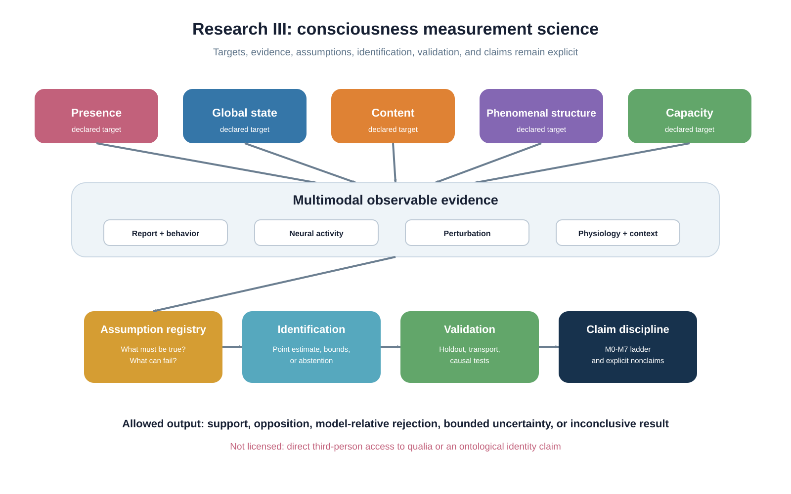
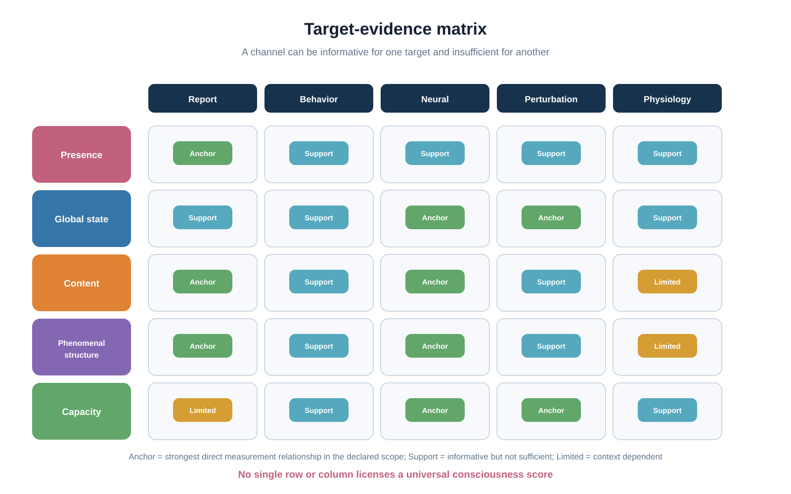
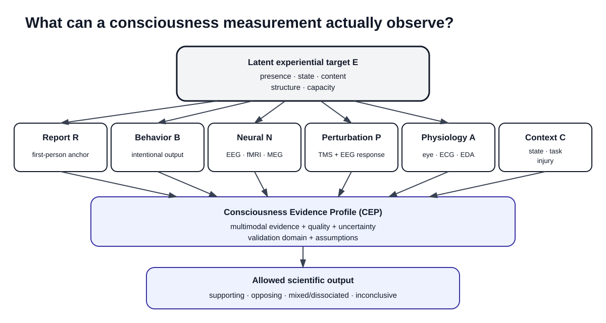
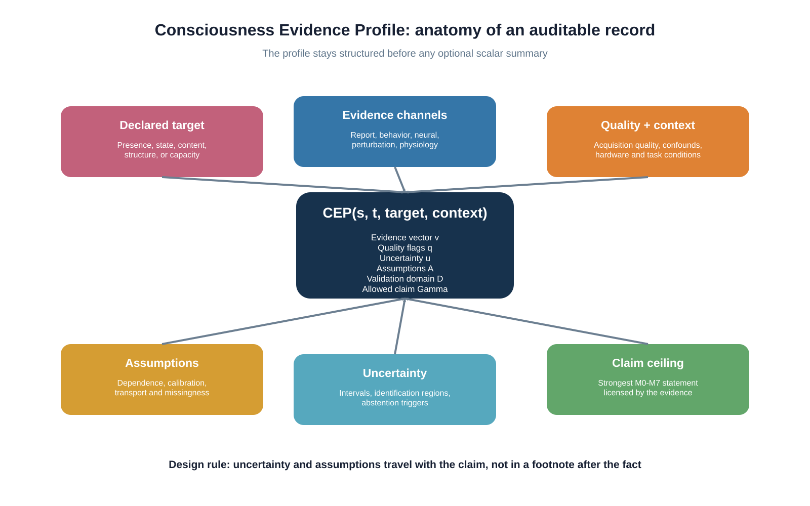
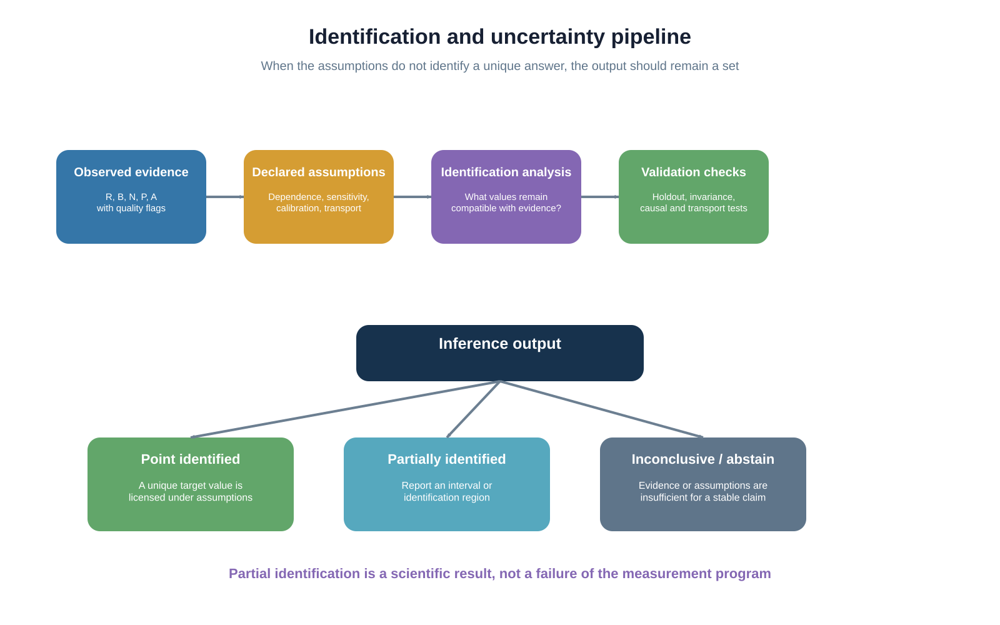
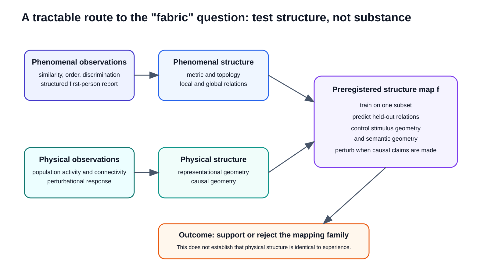
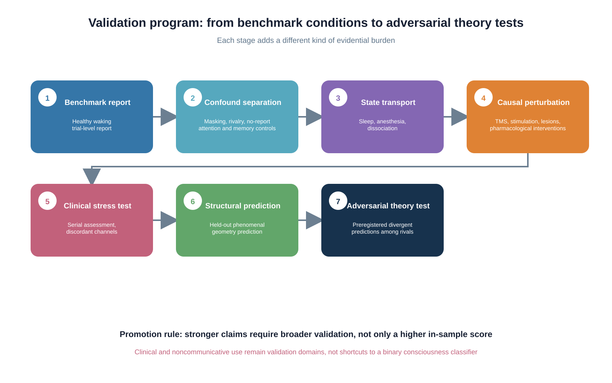
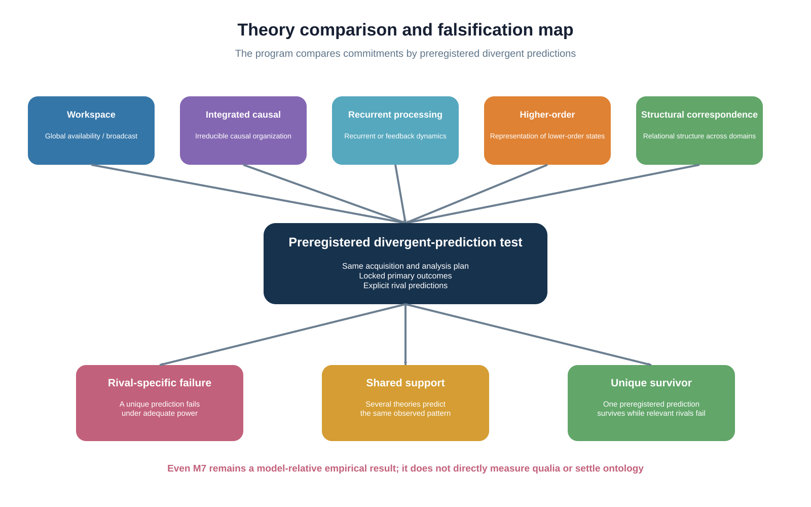
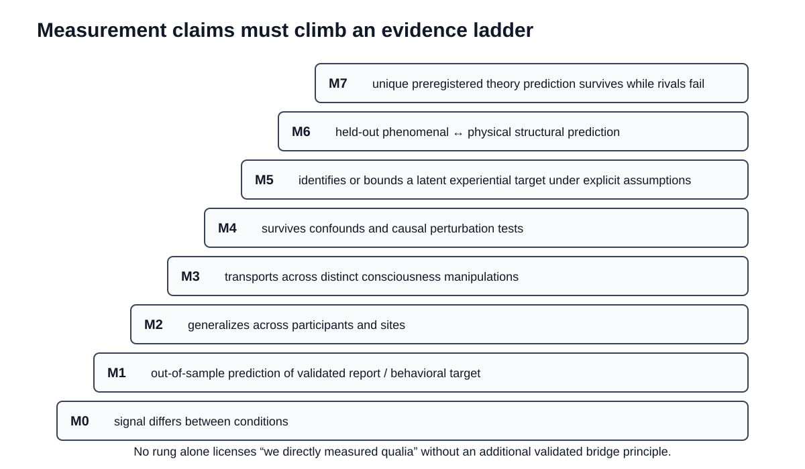

# Consciousness Measurement Science

## A theory-neutral, multimodal, causal, and structural research program

**Status:** foundational research program and computational scaffold. This repository is not a clinical device, does not claim to have solved the hard problem, and does not assume in advance that consciousness is physical, nonphysical, emergent, fundamental, dual-aspect, or reducible to any one measurable signal.

The program asks one concrete measurement-science question:

> **What observations, interventions, mathematical structures, assumptions, and validation standards would justify a scientific claim about consciousness?**

A subject has first-person access to their own experience. An external investigator observes reports, behavior, neural activity, physiology, perturbational responses, interventions, and context. Research III makes the inferential bridge between those observations and a declared experiential target explicit rather than hiding it inside one score.



## Start here

For the fastest technical orientation, use these three entry points first:

1. [Visual Research Guide](docs/visual-research-guide.md) for the complete nine-figure scientific record.
2. [Evidence-to-Claim Audit](docs/evidence-to-claim-audit.md) for the exact path from observable evidence to an allowed scientific claim.
3. [Figure Catalog](docs/figure-catalog.md) for the canonical figure inventory and primary audit source for every visual.
4. [Formal Validation V1-V30](VALIDATION.md) for the executable analytic and synthetic validation record, including sensor-level EM validation V16-V20, source-identifiability validation V21-V25, and electromagnetic resolution and information-limit validation V26-V30.

Then continue with [Start Here](docs/start-here.md), [Research Questions](RESEARCH_QUESTIONS.md), [Formal Measurement Framework](docs/measurement-framework.md), and the full [Documentation Map](docs/README.md).

---

# Visual research record

Research III currently exposes **nine canonical scientific visuals**. They organize the complete measurement program without converting specification into empirical evidence.

## 1. Declared targets, evidence, assumptions, identification, validation, and claims


The whole-program map separates five declared targets - presence, global state, content, phenomenal structure, and capacity - from the observable channels used to study them. Evidence reaches a claim only through explicit assumptions, identification analysis, validation, and claim discipline.

Audit: [Measurement Framework](docs/measurement-framework.md), [Assumption Registry](docs/assumption-registry.md), [Claim Registry](docs/claim-registry.md).

## 2. Target-specific evidence matrix



A modality can be informative for one target and insufficient for another. The matrix is not a ranking of evidence channels. It is a guard against category errors such as treating failed motor output as proof of absent experience or treating a neural predictor as direct access to subjective feel.

Audit: [Measurement Instrument Specification](docs/measurement-instrument-spec.md), [Failure Modes](docs/failure-modes.md), [Clinical Translation](docs/clinical-translation.md).

## 3. Measurement architecture



The core architecture separates the latent experiential target from report, behavior, neural activity, perturbational response, physiology, context, and intervention. The allowed output keeps uncertainty, assumptions, validation domain, and claim level visible.

Science observes

\[
D=(R,B,N,P,A,I,C),
\]

but does not directly observe another subject's experience \(E\). The central identification question is therefore

\[
\boxed{
\text{Given }D\text{ and explicit assumptions }\mathcal A,
\text{ what can be identified, bounded, predicted, or falsified about }E?
}
\]

If the evidence and assumptions do not identify a unique answer, the correct output can be an interval, an identification region, competing explanations, or an inconclusive result.

## 4. Consciousness Evidence Profile



The **Consciousness Evidence Profile (CEP)** is structured before it is scalar:

\[
\operatorname{CEP}(s,t,\tau,c)
=
(\mathbf v,\mathbf q,\mathbf u,\mathcal A,\mathcal D,\Gamma).
\]

Here \(s\) is the subject or system, \(t\) is the time window, \(\tau\) is the declared target, \(c\) is context, \(\mathbf v\) is the evidence vector, \(\mathbf q\) contains quality and interpretability, \(\mathbf u\) contains uncertainty, \(\mathcal A\) is the assumption set, \(\mathcal D\) is the validation domain, and \(\Gamma\) is the strongest allowed claim level.

Audit: [CEP Specification](docs/measurement-instrument-spec.md), [CEP schema](schemas/cep.schema.json), [worked CEP example](examples/cep_example.json).

## 5. Identification and uncertainty



A measurement program must distinguish three valid outcomes:

- **point identified:** one target value is licensed under the declared assumptions;
- **partially identified:** a set or interval is licensed, but no unique value is;
- **inconclusive / abstain:** evidence, quality, assumptions, or validation are insufficient for a stable claim.

Partial identification is a scientific result, not an analytical failure.

Audit: [Statistical Validation](docs/statistical-validation.md), [Dependence-Robust Partial Identification](docs/partial-identification.md).

## 6. Phenomenal-structure measurement



The structural arm uses a four-layer preregistered workflow:

1. phenomenal and physical-neural observations;
2. independently constructed relational geometries;
3. a frozen mapping family evaluated on held-out relations;
4. support, rejection, or an inconclusive outcome.

For communicative participants, define phenomenal and physical relational spaces

\[
(\mathcal E,d_E),
\qquad
(\mathcal N,d_N).
\]

A candidate mapping \(f:\mathcal N\to\mathcal E\) can be evaluated with a preregistered held-out distortion statistic. Low distortion can support the declared mapping family. High distortion can reject it. Neither result establishes ontological identity between physical structure and experience.

Audit: [Phenomenal Structure Program](docs/phenomenal-structure.md).

## 7. Validation program



Validation is staged rather than collapsed into one accuracy number. The program moves from report-rich benchmarks through confound separation, transport across altered states, causal perturbation, clinical stress tests, held-out structural prediction, and adversarial theory comparison.

Stronger claims therefore require broader validation, not simply a higher in-sample score.

Audit: [Phase 1 Protocol](docs/protocol-phase1.md), [Experimental Program](docs/experimental-program.md), [Preregistration Template](docs/preregistration-template.md), [Roadmap](ROADMAP.md).

## 8. Theory comparison and falsification



Candidate theories are compared by declared commitments and preregistered divergent predictions. Shared support is not the same as a unique theory win. A theory-relative empirical result does not settle ontology.

Audit: [Theory Landscape](docs/theory-landscape.md), [Falsification Matrix](docs/falsification-matrix.md), [Literature Map](docs/literature.md).

## 9. Measurement claim ladder



The repository uses a conservative M0-M7 ladder:

| Level | Allowed claim |
|---|---|
| **M0** | A signal, behavior, or feature differs between declared experimental conditions. |
| **M1** | A locked model predicts a validated report or behavioral target out of sample. |
| **M2** | The relation generalizes across participants or sites inside a declared domain. |
| **M3** | The relation generalizes across distinct consciousness manipulations or states. |
| **M4** | The relation survives confound controls and causal perturbation tests. |
| **M5** | A multimodal model identifies or bounds a latent experiential target under explicit assumptions. |
| **M6** | A preregistered physical structure predicts held-out phenomenal structure. |
| **M7** | A candidate theory makes a unique preregistered prediction that survives while relevant rivals fail. |

No rung licenses the statement that qualia have been directly measured.

Audit: [Claim Registry](docs/claim-registry.md), [claim schema](schemas/claim.schema.json), [worked claim example](examples/claim_example.json).

---

## What exactly is being measured?

The repository separates targets that are often mixed together:

| Target | Core question | Typical anchors | Common category error |
|---|---|---|---|
| **Presence** | Is there evidence that any experience is occurring? | report when available, covert command following, state markers, perturbational capacity | treating one failed channel as proof of absence |
| **Global state** | What multidimensional condition is the system in? | arousal, connectedness, complexity, stability, cognitive availability | compressing all states into one universal level |
| **Content** | What is being experienced? | trial-level report, decoding, discrimination, structured behavior | confusing stimulus decoding with experience decoding |
| **Phenomenal structure** | What relations hold among experiences? | similarity, ordering, discriminability, report geometry | assuming matched neural geometry is ontological identity |
| **Capacity** | Does the system have organization capable of supporting experience? | causal organization, perturbational response, recurrent dynamics | equating capacity with a currently occurring content |

A measure validated for one target cannot automatically be promoted to another.

---

## Evidence architecture

Current consciousness science contains many useful measurements, but each occupies a different evidential layer.

| Evidence channel | What it can support | What it cannot establish by itself |
|---|---|---|
| First-person report | experienced content when communication is reliable | direct third-person access to qualia |
| Intentional behavior | command following, discrimination, communication | absence of experience when motor output fails |
| Task EEG/fMRI | covert command following and content-related activity | universal absence of consciousness when negative |
| Resting EEG/MEG/fMRI | state-dependent complexity, connectivity, spectra, network organization | a direct reading of subjective feel |
| Electromagnetic organization features | frequency-specific field organization, entropy, rank, phase structure, perturbational dynamics after acquisition controls | consciousness itself, qualia, or a universal field threshold |
| TMS-EEG / PCI family | perturbational capacity for differentiated, integrated cortical responses | a universal metaphysical cutoff |
| Autonomic and ocular signals | covert evidence when overt report is unavailable | a unique consciousness-specific signature across all settings |
| Lesion, stimulation, pharmacology | causal constraints on candidate mechanisms | a complete explanation of why experience exists |

The program therefore emphasizes triangulation, causal intervention, cross-context validation, explicit uncertainty, and theory comparison.

---

## Electromagnetic measurement arm

Research III now includes a dedicated [Electromagnetic Field Measurement Program](docs/electromagnetic-field-program.md) for V16-V20, an [Electromagnetic Source Identifiability Program](docs/electromagnetic-source-identifiability.md) for V21-V25, and an [Electromagnetic Resolution and Information Program](docs/electromagnetic-resolution-program.md) for V26-V30.

The measurement model is

\[
\mathbf X(t)=\mathcal M(\mathcal F)(t)+\boldsymbol\eta(t),
\qquad
\mathcal F(\mathbf r,t)=\{\mathbf E(\mathbf r,t),\mathbf B(\mathbf r,t)\},
\]

so a sensor array records a geometry-, hardware-, reference-, and noise-dependent projection of an underlying field rather than an unqualified field essence.

The first electromagnetic feature profile is

\[
\Phi_{EM}=(H_f,C_\phi,r_{\mathrm{eff}},H_{SV},\rho_{CM}),
\]

covering normalized spectral entropy, frequency-specific sensor-phase concentration, covariance effective rank, normalized singular-value entropy, and common-mode fraction.

V26-V30 then quantify a further set of engineering limits: covariance-aware residual geometry, inverse resolution leakage, a rank-only lower bound on identity resolution error, Fisher-information loss under correlated noise, exact temporal aliasing, and worst-case pseudoinverse noise amplification. These are measurement limits, not consciousness measurements.\n\nThe strongest current conclusions are measurement-science conclusions:

- V17 shows the normalized descriptors are invariant to trivial global gain in the declared deterministic construction;
- V18 gives a constructive counterexample in which channel power is matched to numerical precision while spatial phase organization changes from fully aligned to phase balanced;
- V19 shows that a shared contaminant can create strong apparent sensor-wide phase organization;
- V20 shows that organization can be fully aligned at one frequency and phase balanced at another in the same multichannel signal;
- V21 verifies common-reference invariance of pairwise EEG-like differences;
- V22 constructs distinct source vectors with exactly the same ideal sensor measurement through a lead-field null space;
- V23 makes inverse regularization dependence explicit;
- V24 shows how complementary EEG/MEG-like operators can reduce source ambiguity without guaranteeing uniqueness;
- V25 bounds forward-model perturbation error in sensor space.
- V26 verifies covariance-weighted residual geometry through exact whitening;
- V27 quantifies inverse source-resolution error and off-diagonal leakage;
- V28 gives Fisher-information loss and CRLB growth under common correlated sensor noise;
- V29 constructs exact temporal aliasing between distinct continuous frequencies after sampling;
- V30 makes weakest-singular-direction inverse noise amplification explicit through the pseudoinverse norm.


These results justify treating electromagnetic dynamics as a rich candidate evidence channel while keeping sensor measurements, reconstructed sources, and experiential targets scientifically distinct. They do **not** establish an electromagnetic consciousness detector, a universal threshold, or identity between an electromagnetic field and experience.

---

## Scientific role taxonomy

Candidate mechanisms are classified by role rather than by enthusiasm:

- **necessary:** removing the condition eliminates the target within the declared scope;
- **sufficient:** producing the condition produces the target within the declared scope;
- **enabling:** the condition permits the target but is not enough by itself;
- **correlated:** the condition tracks the target but may be prerequisite, consequence, or confound.

This prevents a predictive marker from automatically being described as a mechanism, and prevents a mechanism from automatically being described as ontological identity.

---

## Negative evidence rule

A failed test is not automatically evidence of absent experience.

Negative evidence is interpretable only when the assay has demonstrated sensitivity to the declared target, acquisition quality is adequate, the subject or system could in principle produce the measured response, major confounds have been assessed, false-negative behavior is characterized, and the validation domain includes the present use case.

If those conditions fail, the correct output is **uninterpretable or inconclusive**, not evidence for absence.

This boundary is especially important in severe brain injury, paralysis, sleep, sedation, sensory impairment, and other settings where report or motor behavior can fail independently of experience.

---

## Statistical and validation requirements

A candidate measurement model is not accepted because it has attractive visualizations or high in-sample accuracy. Confirmatory work requires, as appropriate:

- participant-level and site-level holdout;
- calibration, not only discrimination;
- proper scoring rules;
- uncertainty intervals and identification regions;
- measurement-invariance checks;
- transport to new states and hardware;
- sensitivity to missing data and channel dependence;
- positive and negative controls;
- multiplicity control;
- explicit abstention behavior;
- strong single-channel baselines;
- prospective preregistration of confirmatory endpoints.

See [Statistical Validation](docs/statistical-validation.md), [Partial Identification](docs/partial-identification.md), and the [Evidence-to-Claim Audit](docs/evidence-to-claim-audit.md).

---

## Clinical boundary

Disorders of consciousness are treated as an important validation domain, not as a shortcut to a binary consciousness classifier. Behavioral and brain-based channels both have false-negative pathways, and discordance itself carries information.

The program therefore requires serial behavioral assessment, confound control, repeated testing where appropriate, multimodal evidence, and explicit uncertainty. See [Clinical Translation](docs/clinical-translation.md) and [Ethics](docs/ethics.md).

Nothing in this repository is intended to guide withdrawal of life support, replace specialist clinical evaluation, or function as a diagnostic medical device.

---

## Reproducible computational scaffold

The package contains multiple intentionally small, auditable components:

- `evidence.py` implements likelihood-ratio updates under an explicit conditional-independence assumption;
- `partial_identification.py` computes sharp marginal-only Frechet-Hoeffding bounds when conditional dependence is unknown;
- `profile.py` implements target-specific CEP records with an explicit inconclusive state and conservative negative-evidence rules;
- `structural_alignment.py` implements distance matrices, relational alignment, normalized distortion, and permutation testing;
- `electromagnetic_observables.py` implements physical EM sanity checks and normalized multichannel field-organization descriptors;
- `electromagnetic_simulations.py` implements deterministic V16-V20 gain, non-identifiability, confound, and frequency-specific stress tests;
- `electromagnetic_inverse.py` implements reference-invariant sensor relations, lead-field rank/nullity, null-space alternatives, regularized inverse estimates, multimodal stacking, and forward-model perturbation bounds;
- `electromagnetic_inverse_simulations.py` implements deterministic V21-V25 source-identifiability and forward/inverse stress tests.
- `electromagnetic_resolution.py` implements covariance weighting, source-resolution diagnostics, Fisher information, sampling alias checks, and pseudoinverse noise-amplification bounds;
- `electromagnetic_resolution_simulations.py` implements deterministic V26-V30 resolution and information-limit experiments.

These are research scaffolds, not clinical classifiers.

Install and run:

```bash
python -m pip install -e ".[dev]"
make check
```

`make check` runs unit tests, repository-policy verification, and Ruff. See [Software Guide](docs/software-guide.md), [Reproducibility](docs/reproducibility.md), and [Repository Policy](docs/repository-policy.md).

---

## Machine-readable research objects

| Object | File | Purpose |
|---|---|---|
| CEP schema | [schemas/cep.schema.json](schemas/cep.schema.json) | machine-readable evidence-profile contract |
| CEP example | [examples/cep_example.json](examples/cep_example.json) | worked nonclinical profile example |
| Claim schema | [schemas/claim.schema.json](schemas/claim.schema.json) | machine-readable M0-M7 claim record |
| Claim example | [examples/claim_example.json](examples/claim_example.json) | worked claim with assumptions and nonclaims |
| Repository policy | [scripts/verify_repository_policy.py](scripts/verify_repository_policy.py) | checks links, schemas, figures, and publication rules |

Supporting guides: [Schemas Guide](schemas/README.md), [Examples Guide](examples/README.md), [Claims Guide](claims/README.md), [Data Policy](data/README.md).

---

## Documentation and audit map

### Foundations

- [Visual Research Guide](docs/visual-research-guide.md)
- [Figure Catalog](docs/figure-catalog.md)
- [Evidence-to-Claim Audit](docs/evidence-to-claim-audit.md)
- [Start Here](docs/start-here.md)
- [Research Questions](RESEARCH_QUESTIONS.md)
- [Glossary](docs/glossary.md)
- [Epistemic Boundaries](docs/epistemic-boundaries.md)
- [Formal Measurement Framework](docs/measurement-framework.md)
- [Assumption Registry](docs/assumption-registry.md)
- [Failure Modes](docs/failure-modes.md)

### Measurement architecture

- [Consciousness Evidence Profile specification](docs/measurement-instrument-spec.md)
- [Claim Registry](docs/claim-registry.md)
- [Machine-readable CEP schema](schemas/cep.schema.json)
- [Worked CEP example](examples/cep_example.json)
- [Machine-readable claim schema](schemas/claim.schema.json)
- [Worked claim example](examples/claim_example.json)

### Empirical program

- [Phase 1 Protocol](docs/protocol-phase1.md)
- [Preregistration Template](docs/preregistration-template.md)
- [Experimental Program](docs/experimental-program.md)
- [Electromagnetic Field Measurement Program](docs/electromagnetic-field-program.md)
- [Electromagnetic Source Identifiability Program](docs/electromagnetic-source-identifiability.md)
- [Electromagnetic Resolution and Information Program](docs/electromagnetic-resolution-program.md)
- [Formal Validation V1-V30](VALIDATION.md)
- [Validation Atlas](docs/validation-atlas.md)
- [Statistical Validation Plan](docs/statistical-validation.md)
- [Dependence-Robust Partial Identification](docs/partial-identification.md)
- [Clinical Translation](docs/clinical-translation.md)
- [Ethics](docs/ethics.md)
- [Edge Cases](docs/edge-cases.md)

### Theory and structure

- [Phenomenal Structure Program](docs/phenomenal-structure.md)
- [Theory Landscape](docs/theory-landscape.md)
- [Falsification Matrix](docs/falsification-matrix.md)
- [Literature Map](docs/literature.md)

### Implementation and governance

- [Software Guide](docs/software-guide.md)
- [Reproducibility](docs/reproducibility.md)
- [Repository Policy](docs/repository-policy.md)
- [Contributing](CONTRIBUTING.md)
- [Roadmap](ROADMAP.md)

---

## Current implementation status

### Implemented now

- five-target taxonomy: presence, global state, content, phenomenal structure, capacity;
- explicit epistemic and ontological boundaries;
- formal latent-target measurement model;
- Consciousness Evidence Profile specification and JSON schema;
- M0-M7 claim ladder;
- machine-readable claim schema and example;
- assumption registry and failure-mode registry;
- preregistration template and cross-state Phase 1 protocol;
- staged experimental roadmap;
- theory landscape and falsification matrix;
- phenomenal-structure framework;
- statistical validation rules and dependence-robust partial-identification bounds;
- clinical translation and ethics boundaries;
- edge-case standards for infants, animals, organoids, and artificial systems;
- computational scaffolds for evidence fusion, partial identification, CEP records, structural alignment, and electromagnetic observables;
- executable formal validation through V30, including electromagnetic invariance, matched-power non-identifiability, common-mode confounding, frequency-specific structure, lead-field null-space non-identifiability, inverse regularization sensitivity, multimodal null-space reduction, forward-model perturbation, covariance whitening, source-resolution leakage, correlated-noise Fisher information, temporal aliasing, and inverse noise-amplification tests;
- nine canonical scientific visuals with a dedicated visual guide and figure catalog;
- unit tests and repository-wide publication checks.

### Not yet established

The repository does **not** yet contain prospective human data that validate a general consciousness measure, a clinically approved instrument, a universal threshold, a demonstrated substrate-independent scalar, direct third-person access to qualia, a validated universal electromagnetic consciousness signature, or a completed adversarial theory tournament.

Those are empirical milestones, not documentation gaps. The [Roadmap](ROADMAP.md) states the evidence required before they can be claimed.

---

## What this project may eventually establish

A mature version of the program could support claims such as:

- a multimodal signature is a calibrated predictor of a declared experiential target across multiple altered states;
- a perturbational response is necessary for a defined class of conscious states within tested conditions;
- a candidate neural architecture is not sufficient because experience dissociates from it;
- a relational geometry of experience is predicted by a physical or causal representation with bounded held-out distortion;
- one theory's unique preregistered prediction survives an adversarial test while relevant competitors fail;
- certain experiential claims remain non-identifiable from available third-person data.

These would be strong scientific results even if the ultimate explanatory question of why experience exists remains open.

## What this project will not claim without new evidence

It will not claim that:

- consciousness has been proven nonphysical;
- consciousness has been reduced to a conventional state of matter;
- any current scalar metric equals consciousness;
- electromagnetic field strength, power, coherence, entropy, rank, phase concentration, or a particular source reconstruction by itself equals or proves consciousness;
- high complexity alone proves consciousness;
- a failed descriptor proves dualism, idealism, or panpsychism;
- a current AI system is conscious because it behaves intelligently;
- quantum mechanics is required merely because consciousness is mysterious;
- correlation closes the explanatory gap;
- a negative bedside, EEG, fMRI, or perturbational result proves absence of experience without validated sensitivity.

---

## Scientific north star

The goal is not to manufacture certainty where science does not yet have it.

The goal is to make consciousness measurement progressively harder to fool: harder to fool with behavior, harder to fool with one biomarker, harder to fool with theory-confirming analysis, harder to fool with hidden assumptions, harder to fool with data leakage, and harder to fool with elegant mathematics that lacks discriminating empirical predictions.

If a broadly valid consciousness measure is possible, this program aims to define the evidence required to earn that claim. If it is not possible under available observations and assumptions, the program should make that limitation scientifically visible.
