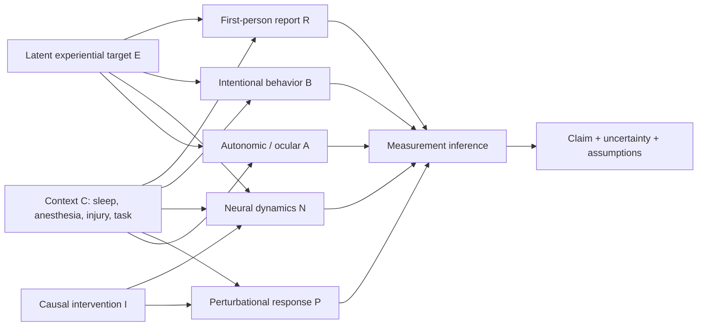
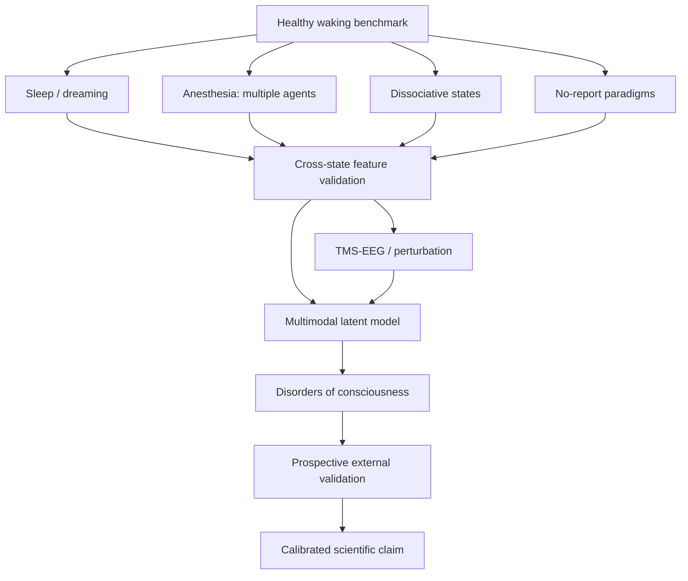

# Consciousness Measurement Science

## A theory-neutral, multimodal, causal, and structural research program

**Research status:** foundational research program, not a clinical device and not a claim to have solved the hard problem.

This repository asks a narrower and more tractable question than “What is consciousness made of?”:

> **What observations, interventions, mathematical structures, and validation standards would justify a scientific measurement claim about consciousness?**


The project deliberately separates **experience itself** from the **evidence used to infer it**. It does not define consciousness as EEG complexity, report, behavior, a neural network property, integrated information, global broadcasting, or any other currently contested marker.

The central premise is epistemic rather than metaphysical:

- conscious experience is directly available only to the subject having it;
- third-person science therefore measures reports, behavior, physiology, neural dynamics, perturbational responses, and their relationships;
- a scientific “consciousness measure” is an **inference system with explicit assumptions and uncertainty**, not a magic sensor that reads qualia directly;
- the ontological status of consciousness — emergent, fundamental, dual-aspect, fully physical, or otherwise — remains an open question unless independently established.

---

## The research question

Let \(E\) denote the experiential target, \(R\) first-person report, \(B\) overt behavior, \(N\) neural measurements, \(P\) perturbational responses, \(A\) autonomic/physiological signals, \(I\) interventions, and \(C\) context.

We observe

\[
D=(R,B,N,P,A,I,C),
\]

but we do not directly observe another subject's \(E\).

The measurement problem is therefore:

\[
\boxed{
\text{Given }D\text{ and explicit assumptions }\mathcal A,
\text{ what can be identified, bounded, predicted, or falsified about }E?
}
\]

The project will not hide non-identifiability. When the data do not uniquely determine the experiential claim, the scientifically correct output is an **identification region**, competing explanations, or an inconclusive result.

---

## Why this needs a new framework

Current consciousness science already has powerful tools, but each measures a different evidential layer:

| Evidence channel | What it can establish well | What it cannot establish by itself |
|---|---|---|
| First-person report | experienced content when communication is reliable | third-person access to qualia as such |
| Intentional behavior | command following, discrimination, communication | absence of experience when motor output fails |
| Task EEG/fMRI | covert command following and content-related responses | universal absence of consciousness when negative |
| Resting EEG/MEG/fMRI | state-dependent complexity, connectivity, spectral and network features | direct reading of subjective feel |
| TMS-EEG / PCI family | perturbational capacity for differentiated, integrated cortical responses | a universal metaphysical cutoff for consciousness |
| Autonomic/ocular signals | covert state/content clues without overt report | a unique consciousness-specific signature in all settings |
| Lesion/stimulation/pharmacology | causal constraints on candidate mechanisms | a complete explanation of why experience exists |

A rigorous program therefore needs **triangulation, causal interventions, cross-context validation, and explicit theory comparison**.

---

## Core architecture



The arrows are **hypotheses to test**, not declarations that every channel is caused only by experience.

---


## Two research arms

### Arm A — Conscious-state inference

The goal is to infer evidence for preserved conscious processing across conditions where report and behavior may fail.

The output is not initially a single scalar. We use an evidence vector

\[
\mathbf V=(V_R,V_B,V_N,V_P,V_A),
\]

with channel-specific uncertainty, validity domain, and dependence assumptions.

A composite score is allowed only after prospective validation demonstrates that combining channels improves calibrated prediction without erasing meaningful dissociations.

### Arm B — Phenomenal-structure measurement


The “fabric” question is approached without assuming a substance.

For communicative participants, construct a phenomenal relational space

\[
(\mathcal E,d_E)
\]

from similarity judgments, discriminability, ordering, and structured reports. Construct a physical/neural relational space

\[
(\mathcal N,d_N)
\]

from neural population activity, effective connectivity, perturbational response, or representational geometry.

Then test whether there exists a structure-preserving map \(f:\mathcal N\to\mathcal E\). A simple distortion statistic is

\[
\boxed{
D(f)=\frac{1}{|\mathcal P|}
\sum_{(i,j)\in\mathcal P}
\left|
\tilde d_E(e_i,e_j)-\tilde d_N(n_i,n_j)
\right|.
}
\]

Low distortion would support a structural correspondence hypothesis. High distortion would reject that particular mapping. Neither result, by itself, proves that the neural structure **is** experience.

---

## What exactly are we trying to measure?

This project separates five targets that are often conflated:

1. **Presence:** is there evidence that any experience is occurring?
2. **Global state:** what multidimensional condition is the system in — arousal, connectedness to environment, cognitive availability, complexity, stability, etc.?
3. **Content:** what is being experienced?
4. **Structure:** what relations hold among contents or qualities of experience?
5. **Capacity:** does the system have the causal/dynamical organization associated with supporting experience, even when content is inaccessible to us?

A measure validated for one target cannot automatically be promoted to another.

---

## Necessary, sufficient, enabling, and correlated conditions

The project will classify candidate mechanisms into four logically different roles:

- **necessary:** removing the condition eliminates the target under the declared scope;
- **sufficient:** producing the condition produces the target under the declared scope;
- **enabling:** the condition permits consciousness but is not itself enough;
- **correlated:** the condition tracks consciousness but may be a prerequisite, consequence, or confound.

This distinction is essential. Arousal systems, recurrent cortical processing, thalamocortical interactions, global availability, posterior content representations, prefrontal metacognitive processes, complexity, and integration may occupy different roles in different theories and states.

---

## Candidate “fabric” hypotheses

The project does not select one ontology in advance. It organizes candidate accounts by the empirical commitments they make.

| Hypothesis family | Candidate substrate/process | Measurement strategy | Scientific status in this project |
|---|---|---|---|
| Global workspace | widespread availability/broadcast | ignition, long-range coupling, access and report | testable, theory-dependent |
| Integrated causal structure | irreducible cause-effect organization | perturbation, integration/differentiation, causal structure | testable, theory-dependent |
| Recurrent processing | local/recurrent feedback | timing, laminar/recurrent signatures, masking | testable, theory-dependent |
| Higher-order/metacognitive | representation of lower-order states | confidence, metacognition, prefrontal signatures | testable, theory-dependent |
| Dynamical/critical regime | rich recurrent metastable dynamics | complexity, entropy, effective connectivity, criticality | testable, non-unique |
| Structural correspondence | relational structure of experience mirrored by physical structure | geometry/topology/representation alignment | central research arm |
| Fundamental or dual-aspect | experiential properties are basic or dual-aspect | requires unique bridge laws/predictions | open; not assumed |
| Quantum-specific | uniquely quantum mechanism is necessary | must predict effects not captured classically | open; high evidential burden |

The 2025 large adversarial test of IIT and GNWT is treated as a methodological model: derive risky, divergent predictions in advance and allow data to challenge all favored theories.

---

## Measurement claim ladder

The repository uses a conservative claim ladder.

| Level | Allowed claim |
|---|---|
| M0 | signal or behavior differs between experimental conditions |
| M1 | signal predicts a validated report/behavioral target out of sample |
| M2 | signal generalizes across subjects/sites within a declared context |
| M3 | signal generalizes across distinct consciousness manipulations (sleep, anesthesia, injury, etc.) |
| M4 | signal survives confound controls and causal perturbation tests |
| M5 | multimodal model identifies/bounds a latent experiential target under explicit assumptions |
| M6 | structural mapping links phenomenal organization to physical organization with preregistered out-of-sample predictions |
| M7 | candidate theory makes unique successful predictions that rival theories fail |

No level licenses the statement “we directly measured qualia” without an additional defensible bridge principle.

---

## Minimum viable experimental program



The human program should include:

- healthy wakefulness with trial-level reports;
- sleep with dream sampling;
- multiple anesthetic regimes rather than one drug;
- dissociative conditions such as ketamine, where responsiveness and experience can decouple;
- no-report perceptual paradigms;
- motor impairment/locked-in controls;
- disorders of consciousness with serial CRS-R plus task EEG/fMRI where feasible;
- TMS-EEG perturbational recordings;
- autonomic/ocular channels;
- multicenter replication and held-out-site validation.

Sample sizes must be determined from preregistered primary endpoints, anticipated effect sizes, repeated-measures structure, desired calibration error, and external-validation requirements — not from an arbitrary universal number.

---

## Primary validation principles

A candidate consciousness measure must pass all of the following before strong claims are made:

- **construct validity:** does it track the target rather than arousal, attention, memory, movement, or report preparation?
- **convergent validity:** does it agree with independent evidence when that evidence is reliable?
- **discriminant validity:** can it separate consciousness from nearby but distinct processes?
- **measurement invariance:** does the mapping remain interpretable across subjects, sites, states, and hardware?
- **causal sensitivity:** does manipulating candidate mechanisms change the measure in predicted ways?
- **negative controls:** can unconscious processing produce the same signature?
- **positive controls:** can known conscious states occur without the signature?
- **calibration:** do predicted probabilities or evidence strengths match observed frequencies in benchmark tasks?
- **transportability:** does performance survive new hospitals/labs/populations?
- **uncertainty honesty:** are negative findings treated as absence of evidence when sensitivity is limited?

---

## Clinical boundary

The 2024 multicenter study of disorders of consciousness found covert command following with fMRI or EEG in 25% of participants who showed no observable response to commands at the bedside. This makes one principle non-negotiable:

> **Failure of a single behavioral or brain-based test cannot be treated as proof of absent experience unless the test's sensitivity for that person and context is independently established.**

The repository therefore treats clinical consciousness assessment as a **multimodal inference problem**.

Nothing in this repository is intended to guide withdrawal of life support or replace specialist clinical evaluation.

---

## Perturbational complexity: what it means here

PCI and related TMS-EEG measures are among the strongest current candidates for a report-independent index of the brain's capacity for complex integrated responses. The frequently cited empirical cutoff near 0.31 comes from specific benchmark/validation work.

This project will **not** treat 0.31 as a universal law of nature. Thresholds must be tied to:

- the PCI implementation;
- preprocessing choices;
- stimulation site and quality controls;
- reference population;
- clinical/experimental context;
- external validation.

A threshold is a measurement-model parameter, not an ontological definition of consciousness.

---

## Why subjective report remains indispensable

Reports are imperfect, but they are not scientifically disposable. For conscious **content**, first-person evidence provides the principal anchor from which third-person markers are learned and tested.

The program therefore uses report strategically:

- high-quality trial-level reports in communicative participants;
- confidence and metacognitive judgments where appropriate;
- experience-sampling during sleep and altered states;
- structured similarity judgments to reconstruct phenomenal geometry;
- no-report paradigms to test whether neural markers merely reflect reporting operations.

The goal is not “objective measures instead of subjective data.” It is **well-calibrated relations between first-person and third-person evidence**.

---

## Reproducible computational work

The initial code contains two intentionally modest tools:

1. `structural_alignment.py` — compares normalized relational geometries and provides permutation-based evidence for cross-domain structural correspondence.
2. `evidence.py` — demonstrates transparent likelihood-ratio fusion under an explicitly declared conditional-independence assumption.

These are research scaffolds, **not clinical classifiers**.

Run:

```bash
python -m pip install -e ".[dev]"
pytest -q
```

---

## Research documents

- [Research questions](RESEARCH_QUESTIONS.md)
- [Epistemic boundaries](docs/epistemic-boundaries.md)
- [Formal measurement framework](docs/measurement-framework.md)
- [Consciousness Evidence Profile specification](docs/measurement-instrument-spec.md)
- [Phase 1 preregisterable protocol](docs/protocol-phase1.md)
- [Preregistration template](docs/preregistration-template.md)
- [Phenomenal structure program](docs/phenomenal-structure.md)
- [Theory landscape](docs/theory-landscape.md)
- [Falsification matrix](docs/falsification-matrix.md)
- [Experimental program](docs/experimental-program.md)
- [Statistical validation plan](docs/statistical-validation.md)
- [Clinical translation](docs/clinical-translation.md)
- [Ethics](docs/ethics.md)
- [Edge cases: infants, animals, organoids, and AI](docs/edge-cases.md)
- [Claim registry](docs/claim-registry.md)
- [Machine-readable CEP schema](schemas/cep.schema.json) and [worked example](examples/cep_example.json)
- [Literature map](docs/literature.md)
- [Roadmap](ROADMAP.md)

---

## What this project may eventually establish

A mature version of this program could support claims such as:

- a particular multimodal signature is a calibrated predictor of reportable experience across multiple altered states;
- a perturbational response is necessary for a defined class of conscious states within tested conditions;
- a candidate neural architecture is not sufficient because consciousness dissociates from it;
- a relational geometry of experience is preserved by a neural/causal representation with bounded distortion;
- one theory's unique predictions survive adversarial tests while competitors fail;
- certain experiential claims remain non-identifiable from available third-person data.

Those are strong scientific results even if the ultimate “why is there something it is like?” question remains open.

---

## What this project will not claim without new evidence

It will not claim that:

- consciousness has been proven nonphysical;
- consciousness has been reduced to a conventional physical state of matter;
- any scalar metric equals consciousness;
- high complexity alone proves consciousness;
- a failed descriptor proves dualism or panpsychism;
- a current AI system is conscious because it behaves intelligently;
- quantum mechanics is required merely because consciousness is mysterious;
- correlation closes the explanatory gap.

---

## Scientific north star

The aim is not to manufacture certainty where science does not yet have it.

The aim is to make **consciousness measurement progressively harder to fool**: harder to fool with behavior, harder to fool with a single biomarker, harder to fool with theory-confirming analyses, harder to fool with hidden assumptions, and harder to fool with beautiful mathematics that lacks discriminating empirical predictions.

If a universal consciousness meter is possible, this is the kind of validation ladder it will have to survive.
