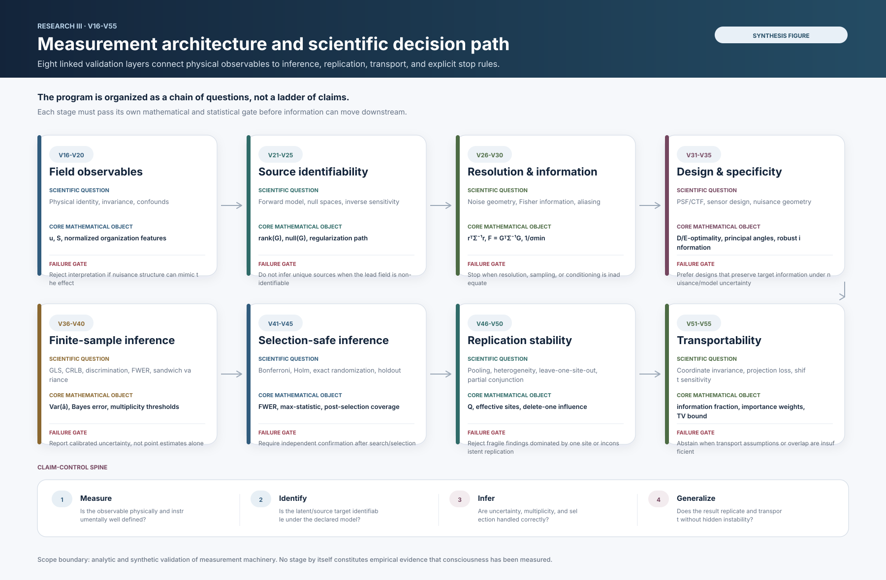
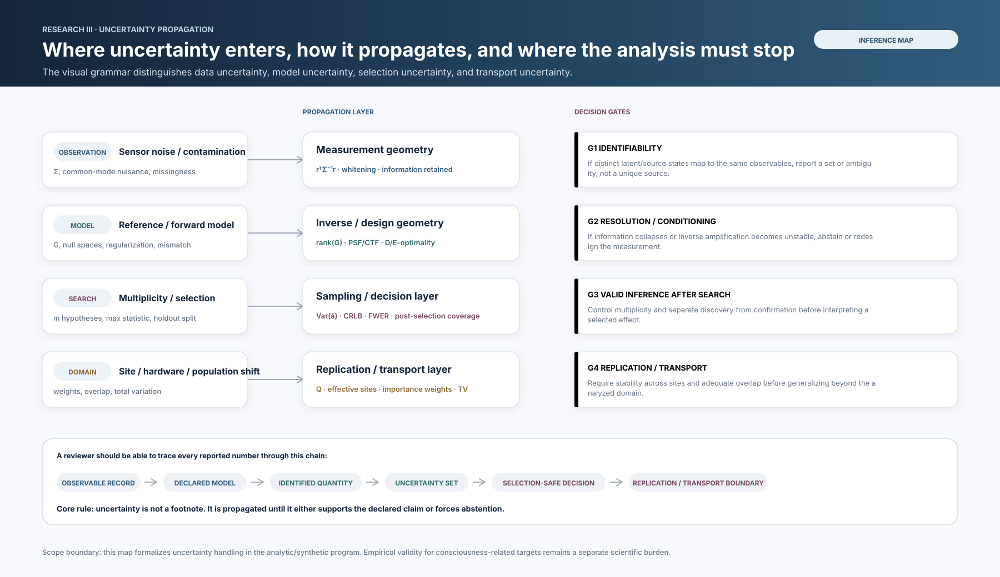
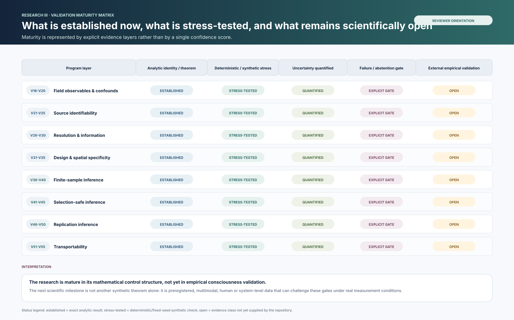

# Research III visual synthesis

These synthesis figures sit above the stage-by-stage V16-V55 result plots. They are not additional empirical results. They organize the existing analytic and synthetic record so a reader can see the scientific logic, uncertainty flow, and remaining evidence gaps before reading individual validation stages.

## 1. Measurement architecture and scientific decision path



This figure organizes V16-V55 as eight linked layers. Every layer names the scientific question, core mathematical object, and a failure gate that prevents an invalid downstream claim.

## 2. Uncertainty propagation and stop rules



This figure separates four uncertainty classes: observation, model, search/selection, and domain/transport uncertainty. The central requirement is that uncertainty must be propagated into an identified set, interval, calibrated decision, or abstention rule rather than hidden in prose.

## 3. Validation maturity matrix



The matrix distinguishes evidence classes rather than assigning a single maturity score. Analytic identities, deterministic or fixed-seed stress tests, quantified uncertainty, and explicit failure gates are present across V16-V55. External empirical validation remains open and is shown explicitly as open rather than implied.

## Reproduce

```bash
python scripts/run_research_visual_synthesis.py
```

The SVG files are deterministic and contain no stochastic output.

## Scientific boundary

These figures summarize the architecture of the Research III measurement program. They do not add human empirical evidence and do not establish that consciousness, qualia, or a consciousness-specific electromagnetic signature has been measured.
