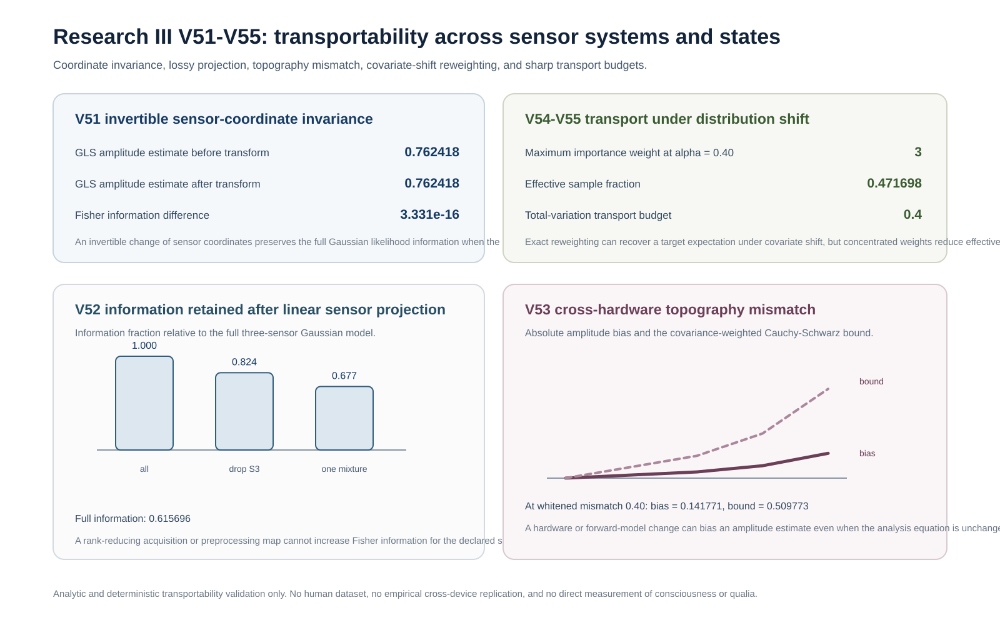

# Transportability Across Sensor Systems, Hardware, and States

## Research III V51-V55

Research III now extends the electromagnetic measurement program from replication inference into an explicit transportability layer.

The scientific question is not whether one result can simply be copied from one device, site, preprocessing pipeline, or state into another. The question is:

> Under which transformations is a declared measurement result invariant, under which transformations is information lost, and how much transport uncertainty must be exposed when the target distribution or measurement operator changes?

This distinction matters for EEG, MEG, OPM-MEG, perturbational recordings, multimodal sensing, and any future consciousness measurement instrument. A marker can replicate in one acquisition domain and still fail when the hardware, sensor geometry, source topography, participant distribution, or physiological state changes.

V51-V55 are analytic and deterministic measurement-science results. They do not use human data and do not establish empirical transport of a consciousness marker.

## Common Gaussian measurement model

For a scalar source or target amplitude (a), let

[
mathbf y = aoldsymbolell + oldsymbolarepsilon,
qquad
oldsymbolarepsilon sim mathcal N(mathbf 0,mathbf C),
]

where (oldsymbolell) is the declared sensor topography and (mathbf C) is positive definite sensor-noise covariance.

The generalized least-squares estimator is

[
widehat a
=
rac{
oldsymbolell^{mathsf T}mathbf C^{-1}mathbf y
}{
oldsymbolell^{mathsf T}mathbf C^{-1}oldsymbolell
},
]

with Fisher information

[
mathcal I
=
oldsymbolell^{mathsf T}mathbf C^{-1}oldsymbolell.
]

This model is deliberately narrow. Its purpose is to isolate transport laws that can be proved exactly before a more complicated empirical model is attempted.

---

## V51. Exact invariance under invertible sensor-coordinate change

Suppose the full sensor model is transformed by an invertible matrix (mathbf H):

[
mathbf y'=mathbf Hmathbf y,
qquad
oldsymbolell'=mathbf Holdsymbolell,
qquad
mathbf C'=mathbf Hmathbf Cmathbf H^{mathsf T}.
]

Because

[
(mathbf Hmathbf Cmathbf H^{mathsf T})^{-1}
=
mathbf H^{-mathsf T}mathbf C^{-1}mathbf H^{-1},
]

the transformed Fisher information is

[
egin{aligned}
mathcal I'
&=
oldsymbolell'^{mathsf T}
mathbf C'^{-1}
oldsymbolell'
\
&=
oldsymbolell^{mathsf T}
mathbf H^{mathsf T}
mathbf H^{-mathsf T}
mathbf C^{-1}
mathbf H^{-1}
mathbf H
oldsymbolell
\
&=
oldsymbolell^{mathsf T}
mathbf C^{-1}
oldsymbolell
=
mathcal I.
end{aligned}
]

The same cancellation gives

[
widehat a'=widehat a.
]

### V51 theorem

**If the sensor-coordinate transformation is invertible and the observation, topography, and covariance are transformed consistently, the Gaussian scalar-amplitude likelihood contains exactly the same Fisher information and gives exactly the same GLS amplitude estimate.**

This is a coordinate-invariance result, not a statement that arbitrary preprocessing is harmless.

### Canonical V51 check

For the committed three-sensor construction,

[
mathcal I
=
0.6156957928802589,
]

and after an invertible transform with determinant (1.1),

[
mathcal I'
=
0.6156957928802586.
]

The difference is numerical roundoff. The GLS estimate is likewise preserved:

[
widehat a
=
0.7624178712220763,
qquad
widehat a'
=
0.7624178712220766.
]

### Scientific consequence

Two sensor representations can look numerically different while carrying the same information about the declared target. A scientifically meaningful cross-device comparison should therefore distinguish harmless invertible reparameterization from genuine information loss or model mismatch.

---

## V52. Information monotonicity under lossy linear projection

Now let (mathbf P) be a full-row-rank linear projection that can reduce dimension:

[
mathbf y_P=mathbf Pmathbf y.
]

The projected model has

[
oldsymbolell_P=mathbf Poldsymbolell,
qquad
mathbf C_P=mathbf Pmathbf Cmathbf P^{mathsf T},
]

and Fisher information

[
mathcal I_P
=
oldsymbolell^{mathsf T}
mathbf P^{mathsf T}
(mathbf Pmathbf Cmathbf P^{mathsf T})^{-1}
mathbf P
oldsymbolell.
]

Let

[
mathbf z=mathbf C^{-1/2}oldsymbolell,
qquad
mathbf A=mathbf Pmathbf C^{1/2}.
]

Then

[
mathcal I_P
=
mathbf z^{mathsf T}
mathbf A^{mathsf T}
(mathbf Amathbf A^{mathsf T})^{-1}
mathbf A
mathbf z.
]

The middle matrix is the orthogonal projector onto the row space of (mathbf A). Therefore

[
oxed{
mathcal I_P le |mathbf z|_2^2=mathcal I.
}
]

Equality holds exactly when the whitened target direction lies entirely in the retained row space.

### V52 theorem

**A deterministic rank-reducing linear acquisition or preprocessing map cannot create Fisher information about the declared scalar target. It can only preserve or destroy it.**

### Canonical V52 check

The committed model gives:

| Representation | Information fraction |
|---|---:|
| all three sensors | 1.000000 |
| drop sensor 3 | 0.824394 |
| one mixed channel | 0.677317 |

### Scientific consequence

Channel reduction, aggressive spatial filtering, lossy harmonization, and hardware-dependent compression should not be treated as scientifically neutral merely because a downstream statistic is still computable.

---

## V53. Exact cross-hardware topography-mismatch bias law

Suppose an estimator is built with nominal topography (oldsymbolell_0) and positive definite weighting matrix (mathbf W), but the true hardware or forward model has topography

[
oldsymbolell_*=oldsymbolell_0+oldsymboldelta.
]

The nominal weighted amplitude estimator is

[
widehat a_0
=
rac{
oldsymbolell_0^{mathsf T}mathbf Wmathbf y
}{
oldsymbolell_0^{mathsf T}mathbf Woldsymbolell_0
}.
]

Under true mean

[
mathbb E[mathbf y]=aoldsymbolell_*,
]

its multiplicative gain is

[
rac{mathbb E[widehat a_0]}{a}
=
rac{
oldsymbolell_0^{mathsf T}mathbf Woldsymbolell_*
}{
oldsymbolell_0^{mathsf T}mathbf Woldsymbolell_0
}.
]

Hence the relative bias is exactly

[
b
=
rac{
oldsymbolell_0^{mathsf T}mathbf Woldsymboldelta
}{
oldsymbolell_0^{mathsf T}mathbf Woldsymbolell_0
}.
]

Define

[
|mathbf x|_{mathbf W}
=
sqrt{mathbf x^{mathsf T}mathbf Wmathbf x}.
]

Cauchy-Schwarz gives

[
oxed{
|b|
le
rac{
|oldsymboldelta|_{mathbf W}
}{
|oldsymbolell_0|_{mathbf W}
}.
}
]

### V53 theorem

**Cross-hardware or forward-model mismatch induces a calculable amplitude bias, and its absolute relative magnitude is bounded by the covariance-weighted mismatch norm divided by the nominal topography norm.**

### Canonical V53 check

At declared whitened mismatch norm (0.40),

[
rac{mathbb E[widehat a_0]}{a}
=
0.8582286207569035,
]

so the absolute relative bias is approximately

[
0.14177137924309646.
]

The analytic Cauchy-Schwarz bound is

[
0.5097730808460976.
]

The bound is deliberately conservative because it protects against the worst alignment of the mismatch with the nominal target direction.

### Scientific consequence

Keeping the same mathematical estimator does not guarantee transport when the actual sensor or forward topography changes. Cross-device claims require the transformation or mismatch to be characterized rather than assumed away.

---

## V54. Exact expectation transport under covariate shift

Let (P) be a source distribution and (Q) a target distribution over the same covariates. Assume

[
Q ll P,
]

so every target-supported event has positive source probability. Define the density ratio

[
w(x)=rac{dQ}{dP}(x).
]

For an outcome or score function (g),

[
oxed{
mathbb E_Q[g(X)]
=
mathbb E_P[w(X)g(X)].
}
]

In a finite discrete domain with probabilities (p_i) and (q_i),

[
w_i=rac{q_i}{p_i},
qquad
sum_i p_iw_i=1.
]

The identity is exact when the covariate-shift model is correct. But large importance weights reveal poor overlap. A population analogue of normalized importance-weight effective sample size is

[
oxed{
eta_{mathrm{ESS}}
=
rac{
(mathbb E_P w)^2
}{
mathbb E_P[w^2]
}
=
rac{1}{mathbb E_P[w^2]}.
}
]

This fraction is one when (P=Q), and approaches zero as the target distribution concentrates in source-rare regions.

### V54 theorem

**Importance weighting exactly transports expectations under the declared covariate-shift and support assumptions, while the second moment of the weights quantifies how much effective information is lost to distributional mismatch.**

### Canonical V54 check

For source probabilities

[
P=(0.5,0.3,0.2)
]

and the declared target shift

[
Q_alpha=(0.5-alpha,0.3,0.2+alpha),
]

the reweighted source expectation agrees with the target expectation to numerical precision for all committed values of (alpha).

At (alpha=0.40),

[
max_i w_i=3,
qquad
eta_{mathrm{ESS}}
=
0.47169811320754707.
]

Thus the transport identity still holds, while the effective information has fallen to less than half of the nominal source amount.

### Scientific consequence

A correct reweighting formula is not sufficient for a stable scientific claim. Overlap and weight concentration must be reported, and a target domain outside source support cannot be repaired by weighting alone.

---

## V55. Sharp bounded-outcome transport budget from total variation

For probability laws (P) and (Q), define total variation distance

[
operatorname{TV}(P,Q)
=
rac{1}{2}|P-Q|_1
]

in the finite discrete case.

If a declared score or outcome obeys

[
mle gle M,
]

then

[
oxed{
|mathbb E_Q g-mathbb E_P g|
le
(M-m)operatorname{TV}(P,Q).
}
]

### Proof

Write

[
h=rac{g-m}{M-m},
]

so (0le hle 1). By the dual characterization of total variation for bounded functions,

[
|mathbb E_Q h-mathbb E_P h|
le
operatorname{TV}(P,Q).
]

Multiplying by (M-m) yields the result.

The constant cannot be improved uniformly. Equality is attained when the bounded score separates the probability mass moved between the positive and negative parts of (Q-P).

### Canonical V55 check

For the same discrete transport sequence used in V54, with score values in ([0,1]),

[
operatorname{TV}(P,Q_alpha)=alpha,
]

and the expectation shift is exactly

[
|mathbb E_{Q_alpha}g-mathbb E_Pg|=alpha.
]

The canonical construction therefore attains the bound.

### V55 theorem

**For a bounded measurement output, total variation gives a sharp worst-case transport budget. A declared amount of distribution shift therefore induces an explicit ceiling on how far the transported expectation can move without additional structure.**

### Scientific consequence

Cross-state or cross-population claims should report a domain-shift budget or an equivalent transport diagnostic instead of assuming that a result retains the same meaning because the analysis code is unchanged.

---

## Combined V51-V55 transportability chain

The five stages separate distinct scientific obligations:

[
	ext{invertible reparameterization}

ightarrow
	ext{lossy projection}

ightarrow
	ext{hardware mismatch}

ightarrow
	ext{population reweighting}

ightarrow
	ext{worst-case transport budget}.
]

They establish that:

1. coordinate changes can be exactly harmless when the complete measurement model is transformed consistently;
2. lossy acquisition cannot generate target information;
3. unknown topography changes can create systematic bias;
4. covariate-shift reweighting can be exact while still becoming statistically fragile because of poor overlap;
5. bounded outcomes admit a sharp distribution-shift sensitivity law.

These results make transportability part of the measurement claim rather than an afterthought.

## What V51-V55 do not establish

They do not establish:

- empirical invariance across real EEG, MEG, OPM-MEG, amplifier, montage, or preprocessing systems;
- empirical transport across wakefulness, sleep, anesthesia, brain injury, or other states;
- that a covariate-shift model is correct for consciousness data;
- that conditional outcome mechanisms are invariant across sites or states;
- that importance weights can recover a target population when target support is absent from source data;
- that an electromagnetic feature is specific to consciousness;
- that a transported physical association is a measurement of experience or qualia.

## Empirical protocol implied by V51-V55

The next empirical benchmark should preregister:

- the target and claim level before transport analysis;
- source and target acquisition systems;
- reference or montage and preprocessing transformations;
- a declared cross-device transformation when one is assumed invertible;
- information retained after any rank-reducing projection;
- source-topography or forward-model mismatch diagnostics;
- source and target covariate distributions;
- support-overlap checks before reweighting;
- maximum importance weight and effective sample fraction;
- calibration before and after transport;
- a transport-abstention rule when overlap, information, or calibration is insufficient;
- separate cross-participant, cross-site, cross-hardware, and cross-state holdouts.

Transport success should be evaluated on independently held-out target-domain data. Analytic transport laws are a design standard, not a substitute for that empirical test.

## Literature anchors

The V51-V55 layer connects the existing EEG/MEG inverse and resolution program to established work on distribution shift and transport.

- Hauk O, Stenroos M, Treder MS. *Towards an objective evaluation of EEG/MEG source estimation methods: The linear approach*. NeuroImage. 2022;255:119177. doi:10.1016/j.neuroimage.2022.119177. Resolution matrices, point-spread functions, and cross-talk functions make the dependence of source inference on the declared linear measurement system explicit.
- Dockes J, Varoquaux G, Poline JB. *Preventing dataset shift from breaking machine-learning biomarkers*. GigaScience. 2021;10(9):giab055. doi:10.1093/gigascience/giab055. Biomedical predictors can fail when the development cohort differs from the target population, motivating explicit dataset-shift analysis rather than automatic generalization.
- Li F, Lam H, Prusty S. *Robust Importance Weighting for Covariate Shift*. Proceedings of Machine Learning Research. 2020;108:352-362. The paper emphasizes that importance weighting can suffer high variance when source and target distributions are far apart.
- Park S, Bastani O, Weimer J, Lee I. *Calibrated Prediction with Covariate Shift via Unsupervised Domain Adaptation*. Proceedings of Machine Learning Research. 2020;108:3219-3229. The work treats calibration itself as vulnerable to covariate shift and uses importance weighting as part of the correction strategy.

The repository does not adopt these methods as evidence of consciousness. They provide statistical and measurement-theory anchors for how a future consciousness marker would have to survive domain change.

## Reproducibility

Source:

- `src/consciousness_measurement/transportability.py`
- `src/consciousness_measurement/transportability_simulations.py`

Tests:

- `tests/test_transportability.py`
- `tests/test_transportability_simulations.py`

Runner:

```bash
python scripts/run_transportability_validation.py
```

Canonical outputs:

- `results/v51_coordinate_invariance.csv`
- `results/v52_projection_information.csv`
- `results/v53_topography_mismatch.csv`
- `results/v54_importance_transport.csv`
- `results/v55_total_variation_transport.csv`
- `results/transportability_validation_summary.json`

Canonical visual:



The entire V51-V55 record is analytic or deterministic. No result in this section is human empirical evidence that consciousness has been measured.
