# Research III Validation Atlas

## From equations to failure tests to reproducible design laws

This page is the visual research record for the executable mathematical layer of Research III. It complements the nine foundational architecture figures with **twenty validation-result figures** generated from deterministic analytic and fixed-seed synthetic experiments.

Each stage states a narrow scientific question, the mathematical object used to answer it, the failure condition, and the exact code or machine-readable record that supports the figure.

> **Boundary:** these results validate measurement machinery under declared analytic or synthetic conditions. They are not human empirical evidence that consciousness has been measured.

---

# Identification and falsification layer V1-V5

## V1. Point identification through an imperfect channel

For latent prevalence \(\pi\), sensitivity \(\alpha\), specificity \(\beta\), proxy rate \(q\), and \(J=\alpha+\beta-1\),

\[
q=(1-\beta)+J\pi,
\qquad
\pi=\frac{q+\beta-1}{J},\quad J>0.
\]

At \(J=0\), the observable rate contains no information about latent prevalence.

Audit: [V1-V5 derivation](formal-validation-program.md), [`latent_measurement.py`](../src/consciousness_measurement/latent_measurement.py), [`test_latent_measurement.py`](../tests/test_latent_measurement.py).

## V2. Finite-sample partial identification

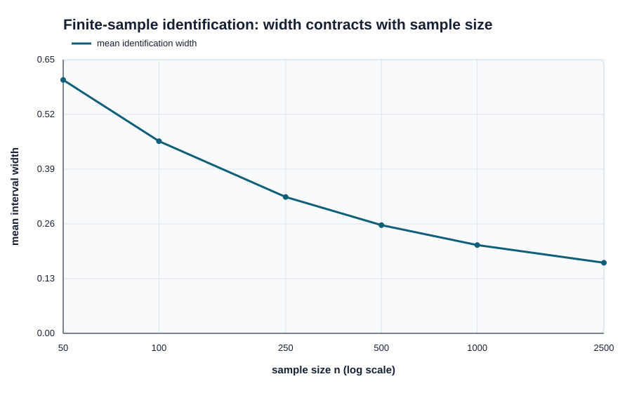

The identified interval contracts with deployment sample size while preserving calibration uncertainty.

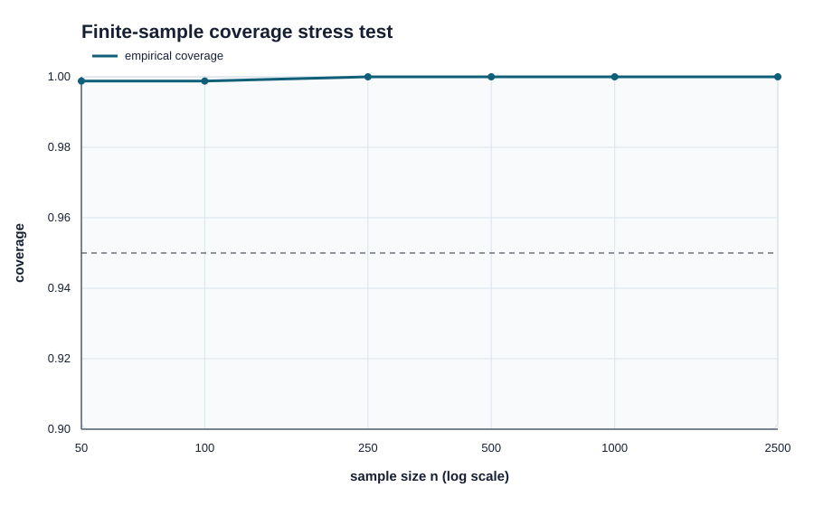

The fixed-seed simulation checks the declared coverage guarantee under the synthetic design.

Audit: [`finite_sample_coverage.csv`](../results/finite_sample_coverage.csv), [`validation_summary.json`](../results/validation_summary.json), [`simulation_validation.py`](../src/consciousness_measurement/simulation_validation.py).

## V3. Measurement transport and calibration shift

Under invariant calibration,

\[
\Delta\pi=\frac{\Delta q}{J}.
\]

When calibration changes, the exact stale-calibration bias is

\[
\operatorname{Bias}
=
\frac{(J_1-J_0)\pi_1+(\operatorname{FPR}_1-\operatorname{FPR}_0)}{J_0}.
\]

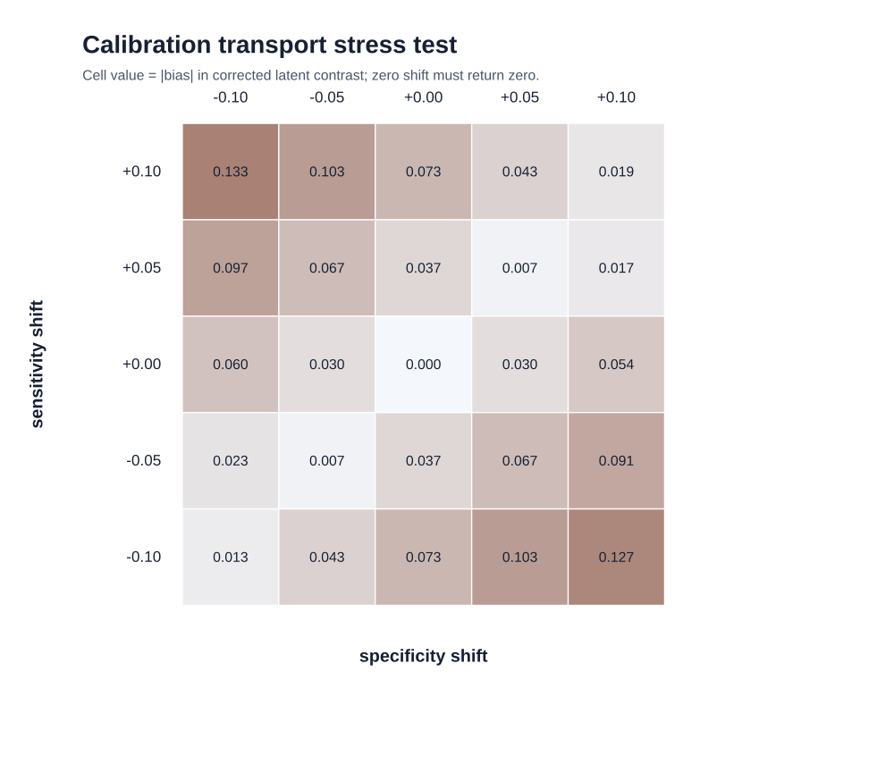

Failure occurs when a state, intervention, site, population, or acquisition change shifts the measurement channel.

Audit: [`transport_stress.csv`](../results/transport_stress.csv), [`latent_measurement.py`](../src/consciousness_measurement/latent_measurement.py).

## V4. Conditional-dependence stress

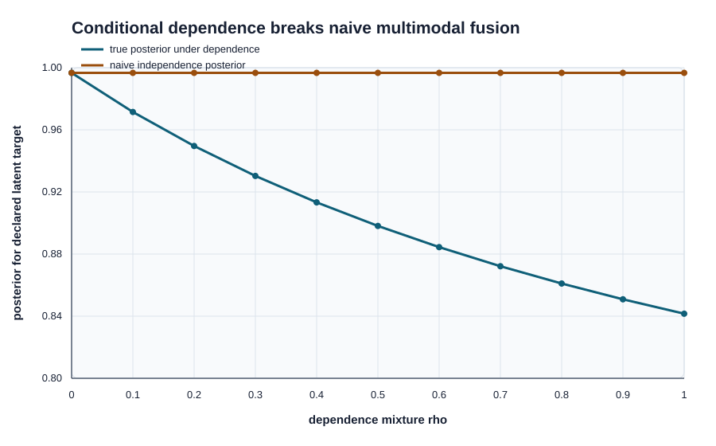

The synthetic construction preserves declared channel marginals while increasing shared dependence. It exposes the confidence inflation caused by multiplying evidence as if conditionally independent.

Audit: [`dependence_stress.csv`](../results/dependence_stress.csv), [`partial_identification.py`](../src/consciousness_measurement/partial_identification.py).

## V5. Structural-alignment null and power

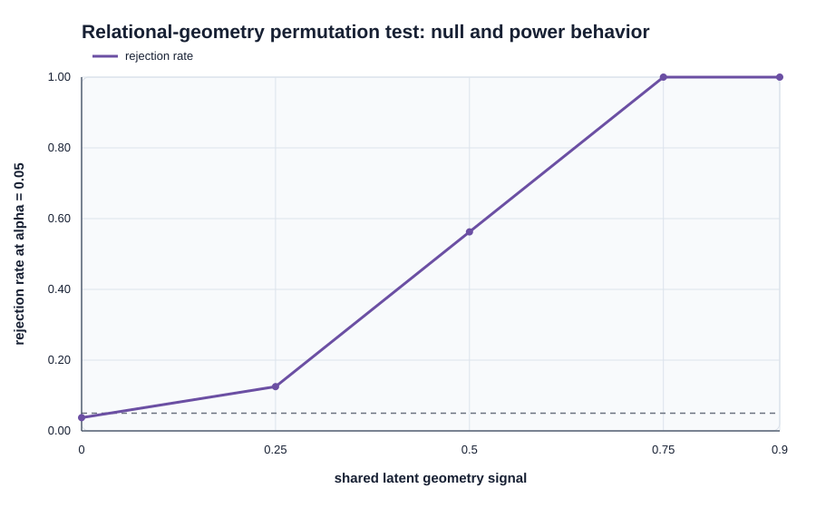

The permutation procedure is checked under a null construction and under increasing planted relational alignment.

Audit: [`structural_alignment_power.csv`](../results/structural_alignment_power.csv), [`structural_alignment.py`](../src/consciousness_measurement/structural_alignment.py).

---

# Robustness layer V6-V10

## V6. Finite calibration-sample uncertainty

For simultaneous proxy, sensitivity, and specificity estimation, the calibration reference sample contributes directly to the final uncertainty budget.

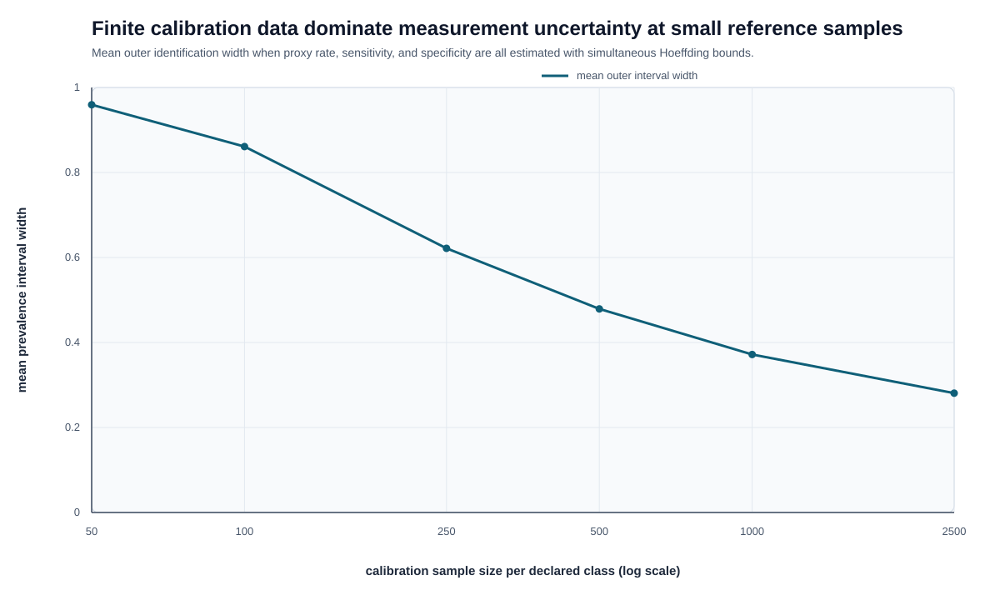

In the canonical run, mean outer-interval width contracts from about `0.960` at 50 calibration observations per class to about `0.281` at 2,500.

Audit: [`calibration_sample_uncertainty.csv`](../results/calibration_sample_uncertainty.csv), [`measurement_robustness.py`](../src/consciousness_measurement/measurement_robustness.py).

## V7. Arbitrary missing outcomes

With \(s_o\) observed positives among \(n_o\) observed outcomes from \(N\) intended measurements,

\[
q\in\left[\frac{s_o}{N},\frac{s_o+N-n_o}{N}\right].
\]

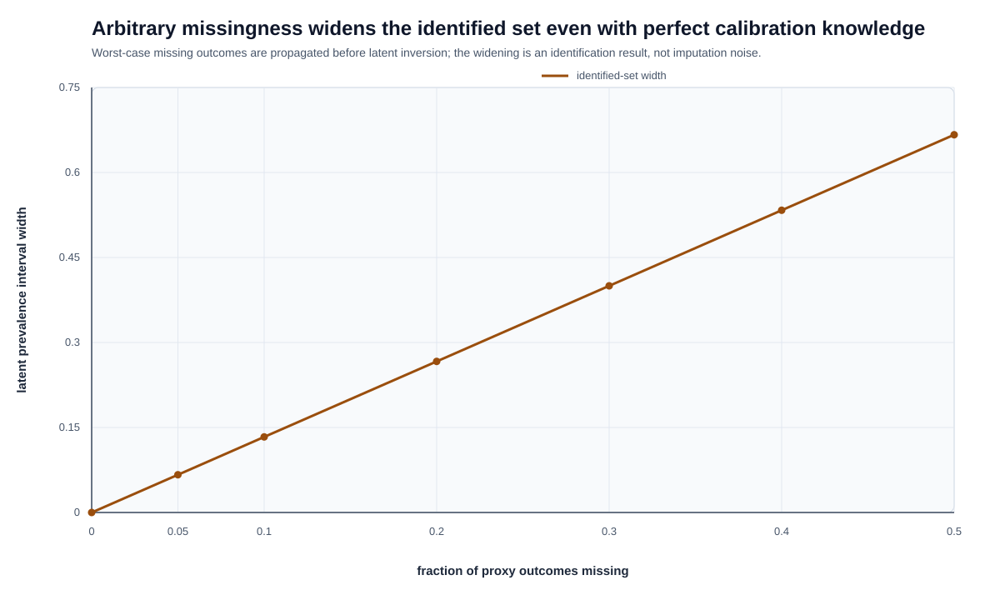

The bounds are sharp without a missing-at-random assumption. Missing outcomes widen the permitted claim rather than being encoded as negative evidence.

Audit: [`missingness_stress.csv`](../results/missingness_stress.csv), [`measurement_robustness.py`](../src/consciousness_measurement/measurement_robustness.py).

## V8. Inverse conditioning

\[
\frac{\partial\pi}{\partial q}=\frac1J,
\qquad
\frac{\partial\pi}{\partial\alpha}=-\frac{\pi}{J},
\qquad
\frac{\partial\pi}{\partial\beta}=\frac{1-\pi}{J}.
\]

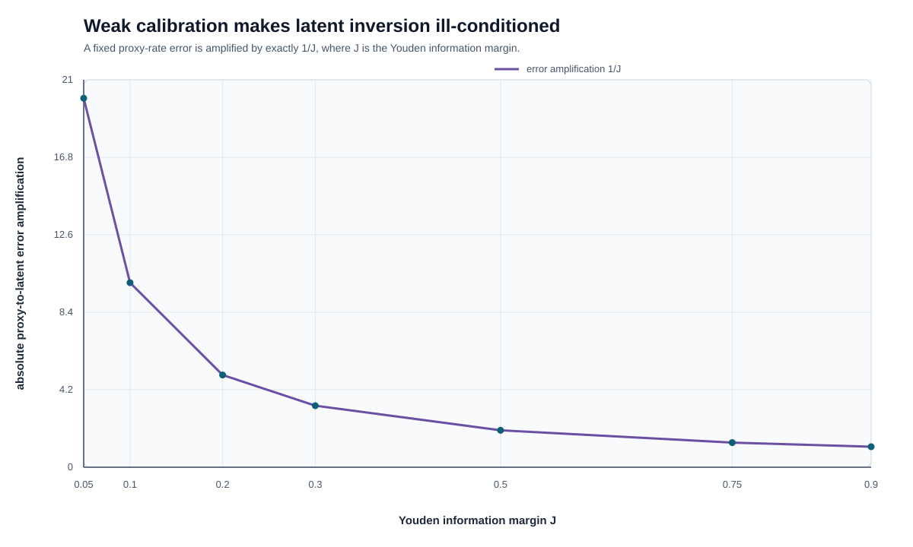

A weak positive information margin can make an algebraically invertible channel scientifically unstable.

Audit: [`conditioning_stress.csv`](../results/conditioning_stress.csv), [`measurement_robustness.py`](../src/consciousness_measurement/measurement_robustness.py).

## V9. Heterogeneous-site non-identifiability

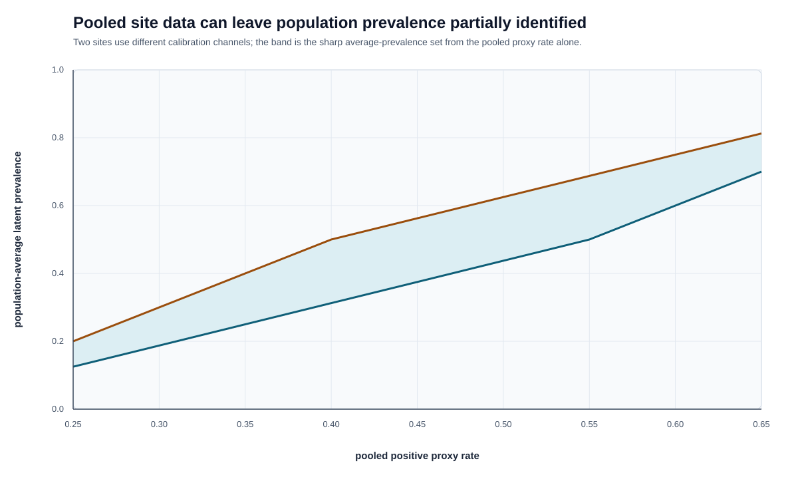

The canonical two-site construction shows that one pooled observable can correspond to distinct population-average latent prevalences when site information slopes differ.

Audit: [`two_site_nonidentifiability.csv`](../results/two_site_nonidentifiability.csv), [`measurement_robustness.py`](../src/consciousness_measurement/measurement_robustness.py).

## V10. Resolution-based abstention

For interval \(I_n=[L_n,U_n]\), release only when

\[
U_n-L_n\le\omega.
\]

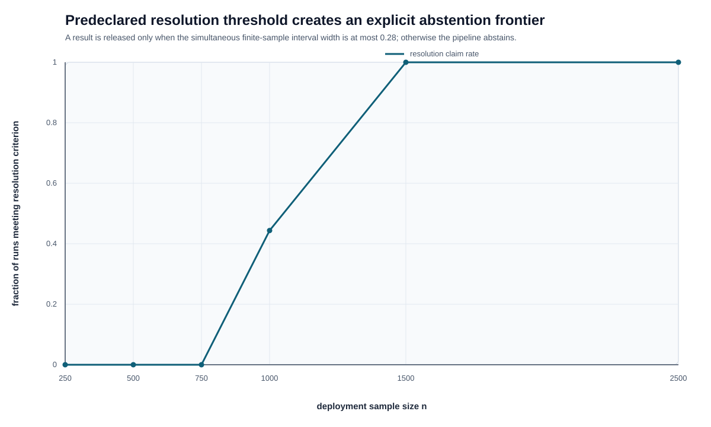

The release rule makes `inconclusive` a valid state. Marginal interval coverage controls erroneous release probability, while coverage conditional on data-dependent release remains a separate question.

Audit: [`resolution_abstention_frontier.csv`](../results/resolution_abstention_frontier.csv), [`robustness_simulations.py`](../src/consciousness_measurement/robustness_simulations.py).

---

# Identification and design layer V11-V15

V11-V15 turn several robustness observations into exact design laws. The new layer asks what resolution is fundamentally available, what pooled multisite quantity is actually identified, how much data a target resolution requires, and how release can be separated from confirmatory inference.

## V11. Exact missingness-resolution law

If \(m\) of \(N\) intended outcomes are unrestricted missing values and calibration is point-known with \(J>0\), then before parameter-boundary clipping the sharp latent width is

\[
\boxed{
W_{\mathrm{miss}}=\frac{m/N}{J}.
}
\]

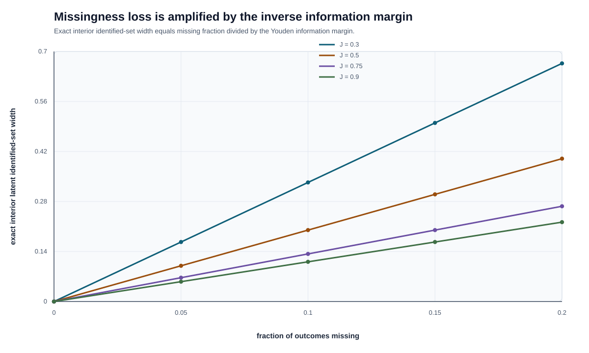

The figure makes the interaction explicit: the same missing fraction creates more latent uncertainty when the measurement channel is weak.

Canonical check: at 10% missingness and \(J=0.75\), the exact interior width is `0.13333333333333333`.

Audit: [V11-V15 derivation](formal-validation-program-v11-v15.md), [`v11_missingness_information_law.csv`](../results/v11_missingness_information_law.csv), [`identification_design.py`](../src/consciousness_measurement/identification_design.py).

## V12. When pooled multisite data identify the population average

For site weights \(w_i\), calibration slopes \(J_i\), and site prevalences \(\pi_i\),

\[
\bar q
=
\sum_i w_i(1-\beta_i)
+
\sum_i w_iJ_i\pi_i.
\]

The target average is

\[
\bar\pi=\sum_iw_i\pi_i.
\]

V12 proves the necessary-and-sufficient condition

\[
\boxed{
J_1=J_2=\cdots=J_K
}
\]

for one pooled proxy rate to identify \(\bar\pi\) for every feasible site-prevalence vector.

If the site slopes differ, the pooled rate identifies a different weighted combination and the population average is generally only partially identified.

Audit: [V11-V15 derivation](formal-validation-program-v11-v15.md), [`test_identification_design.py`](../tests/test_identification_design.py).

## V13. Sharp K-site partial identification

When the V12 equality condition fails, the target interval is the solution of

\[
\min/\max\;\sum_iw_i\pi_i
\]

subject to

\[
\sum_iw_iJ_i\pi_i
=
\bar q-\sum_iw_i(1-\beta_i),
\qquad
0\le\pi_i\le1.
\]

The exact solution is a one-constraint fractional-knapsack problem: allocate prevalence first to the largest \(J_i\) for the lower endpoint and first to the smallest \(J_i\) for the upper endpoint.

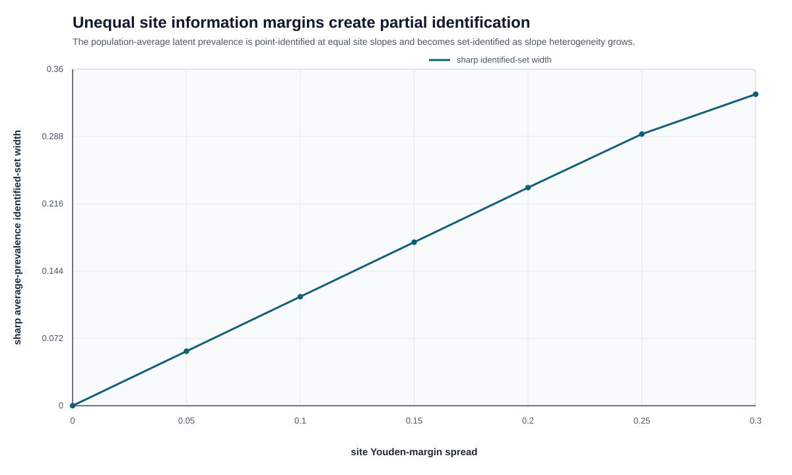

The canonical three-site grid has zero identified-set width at equal information slopes and width `0.3333333333333333` at the declared spread `0.30`.

Audit: [`v12_v13_multisite_identification.csv`](../results/v12_v13_multisite_identification.csv), [`identification_design.py`](../src/consciousness_measurement/identification_design.py).

## V14. Resolution-driven sample-size design

For point-known calibration, a two-sided Hoeffding proxy interval yields the sufficient latent-width design law

\[
\boxed{
 n
\geq
\frac{2\log(2/\delta)}{J^2\omega^2}.
}
\]

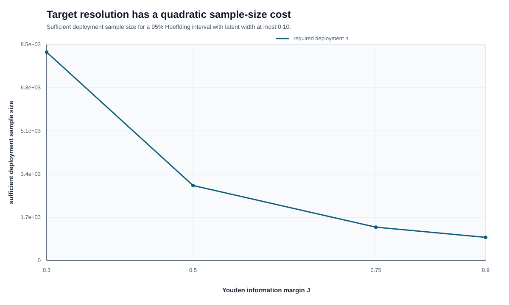

The cost is quadratic in inverse channel strength and inverse target width. Halving \(J\) multiplies the sufficient sample size by four. Halving the target width also multiplies it by four.

Canonical check: \(J=0.75\), \(\omega=0.10\), and \(\delta=0.05\) require `1,312` deployment observations under this design bound.

Audit: [`v14_resolution_sample_size.csv`](../results/v14_resolution_sample_size.csv), [`identification_design.py`](../src/consciousness_measurement/identification_design.py).

## V15. Independent pilot-gated release

V10 showed that a release decision based on the final interval can change the conditional coverage among released cases. V15 gives a simple release architecture that avoids that selection problem.

Let \(G\) be the release event determined only from pilot data. Let \(C\) be the coverage event for an interval built only from independent confirmatory data. Then, whenever \(P(G)>0\),

\[
\boxed{
P(C\mid G)=P(C).
}
\]

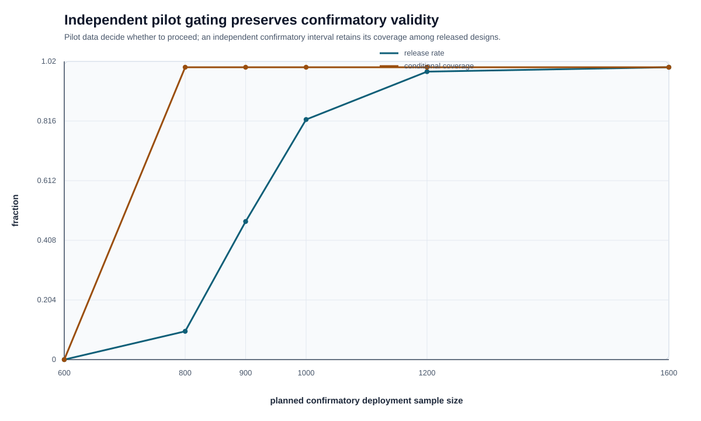

The fixed-seed experiment uses pilot calibration data only to decide whether to proceed and then constructs the final interval from independent deployment and calibration data. At planned confirmatory `n=900`, the canonical release rate is `0.47625`. The observed conditional coverage is `1.0` in that finite run. The theorem does not depend on that simulated value; it follows from independence.

Audit: [`v15_independent_pilot_gate.csv`](../results/v15_independent_pilot_gate.csv), [`identification_design_summary.json`](../results/identification_design_summary.json), [`identification_design_simulations.py`](../src/consciousness_measurement/identification_design_simulations.py).

---

# Electromagnetic measurement layer V16-V20

V16-V20 add electromagnetic recordings as a candidate evidence channel without assuming that an electromagnetic observable is identical to consciousness. The layer asks which physical quantities can be measured cleanly, which organization descriptors are invariant to trivial gain, which information is lost by power-only summaries, and how shared contamination can create misleading apparent organization.

The sensor model is

\[
\mathbf X(t)=\mathcal M(\mathcal F)(t)+\boldsymbol\eta(t),
\qquad
\mathcal F(\mathbf r,t)=\{\mathbf E(\mathbf r,t),\mathbf B(\mathbf r,t)\},
\]

where \(\mathcal M\) contains the acquisition geometry, transfer functions, referencing, and filtering, and \(\boldsymbol\eta\) contains instrumental and environmental contamination.

## V16. Physical field sanity checks

The implementation includes the vacuum electromagnetic identities

\[
u=\frac12\left(\epsilon_0\lVert\mathbf E\rVert^2+\frac{\lVert\mathbf B\rVert^2}{\mu_0}\right),
\qquad
\mathbf S=\frac1{\mu_0}\mathbf E\times\mathbf B.
\]

These are unit and implementation checks, not direct models of propagation through biological tissue.

## V17. Gain-invariant organization descriptors

The first EM feature profile contains normalized spectral entropy, frequency-specific sensor-phase concentration, covariance effective rank, normalized singular-value entropy, and common-mode fraction. The deterministic gain sweep verifies that the normalized descriptors are unchanged when all channels are multiplied by 0.1, 1, or 10.

Audit: [Electromagnetic Field Program](electromagnetic-field-program.md), [`v17_em_scale_invariance.csv`](../results/v17_em_scale_invariance.csv), [`electromagnetic_observables.py`](../src/consciousness_measurement/electromagnetic_observables.py).

## V18. Matched-power non-identifiability

Two eight-sensor 10 Hz fields are constructed with identical power in every channel. One is spatially phase aligned and one is phase balanced.

The canonical construction has maximum relative channel-power difference below `3e-16`, while phase concentration changes from `1.0` to numerical zero.

Therefore:

\[
\boxed{\text{channel power alone does not identify spatial field organization}}
\]

## V19. Shared-field confound

A common 10 Hz contaminant is added to the phase-balanced array. Raw sensor-phase concentration rises from numerical zero to about `0.935` at the largest declared contaminant amplitude even though the underlying sensor-specific phase pattern was not changed. Exact common-mode removal returns the controlled synthetic construction to numerical zero.

This is a confound demonstration, not a claim that common-average subtraction is a universal EEG or MEG correction.

## V20. Frequency-specific organization

The same multichannel signal is fully phase aligned at 10 Hz and phase balanced at 17 Hz:

\[
C_\phi(10\,\mathrm{Hz})=1,
\qquad
C_\phi(17\,\mathrm{Hz})\approx0.
\]

Field organization therefore must be declared in frequency, space, time, and acquisition context rather than compressed into one unqualified scalar.

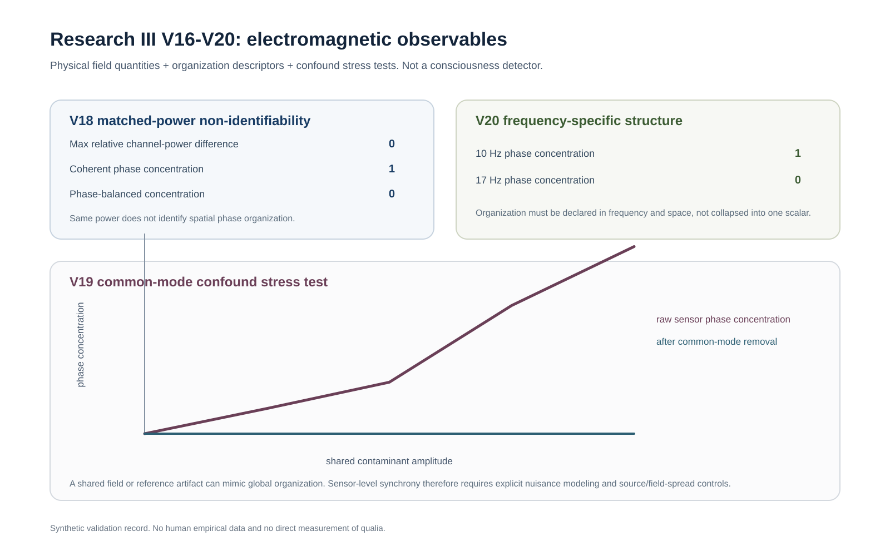

Audit: [Electromagnetic Field Program](electromagnetic-field-program.md), [`electromagnetic_validation_summary.json`](../results/electromagnetic_validation_summary.json), [`v19_common_mode_confound.csv`](../results/v19_common_mode_confound.csv), [`v20_frequency_specific_structure.csv`](../results/v20_frequency_specific_structure.csv), [`electromagnetic_simulations.py`](../src/consciousness_measurement/electromagnetic_simulations.py).

**Claim ceiling:** V16-V20 currently support physical M0 and measurement-design claims only. They do not establish a consciousness-specific electromagnetic signature, direct measurement of qualia, or an electromagnetic ontology of consciousness.

---

# Electromagnetic source-identifiability layer V21-V25

V21-V25 move from sensor-level electromagnetic descriptors to the forward and inverse problem. The source model is

\[
\mathbf y=\mathbf L\mathbf j+\boldsymbol\eta,
\]

where \(\mathbf L\) is a lead-field operator and \(\mathbf j\) is an underlying source vector. The scientific question is what the sensor measurement can identify about \(\mathbf j\) before any experiential interpretation is attempted.

## V21. Common-reference invariance

If the same reference waveform \(r(t)\) is added to every EEG-like channel,

\[
x'_k(t)=x_k(t)+r(t),
\]

then every pairwise difference is unchanged:

\[
x'_i(t)-x'_j(t)=x_i(t)-x_j(t).
\]

The canonical reference-amplitude sweep preserves pairwise differences to below `1.4e-14`.

## V22. Exact lead-field non-identifiability

If \(\mathbf v\in\ker(\mathbf L)\), then

\[
\mathbf L(\mathbf j+\mathbf v)=\mathbf L\mathbf j.
\]

The canonical 3-sensor, 6-source operator has rank `3` and nullity `3`. Two source vectors separated by Euclidean distance `1` produce exactly zero sensor residual.

Therefore:

\[
\boxed{\text{perfect sensor fit does not imply a unique source}}
\]

## V23. Regularization sensitivity

The L2-regularized inverse is

\[
\widehat{\mathbf j}_{\lambda}
=
(\mathbf L^\top\mathbf L+\lambda\mathbf I)^{-1}
\mathbf L^\top\mathbf y.
\]

As \(\lambda\) increases in the canonical path, the selected source norm decreases from about `1.547` to `0.577`, while the sensor residual increases from about `1.43e-5` to `0.521`.

The reconstructed source therefore depends on the inverse prior, not only on the sensor data.

## V24. EEG/MEG-like complementarity

For stacked complementary forward operators,

\[
\ker
\begin{bmatrix}
\mathbf L_E\\
\mathbf L_M
\end{bmatrix}
=
\ker(\mathbf L_E)\cap\ker(\mathbf L_M).
\]

The canonical single-modality nullities are both `3`; the stacked operator reduces nullity to `1`.

Complementary modalities can reduce ambiguity without guaranteeing uniqueness.

## V25. Forward-model perturbation

If the assumed forward operator is perturbed by \(\Delta\mathbf L\), then

\[
\Delta\mathbf y=\Delta\mathbf L\mathbf j,
\]

with

\[
\boxed{
\|\Delta\mathbf y\|_2
\le
\|\Delta\mathbf L\|_2\|\mathbf j\|_2.
}
\]

Every deterministic V25 perturbation satisfies the bound. The nonzero canonical mismatch-to-bound ratio is approximately `0.479`.

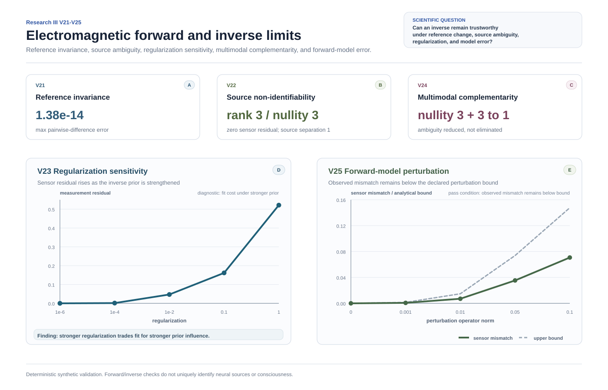

Audit: [Electromagnetic Source Identifiability Program](electromagnetic-source-identifiability.md), [`v21_reference_invariance.csv`](../results/v21_reference_invariance.csv), [`electromagnetic_inverse_validation_summary.json`](../results/electromagnetic_inverse_validation_summary.json), [`v23_regularization_path.csv`](../results/v23_regularization_path.csv), [`v24_multimodal_nullity.csv`](../results/v24_multimodal_nullity.csv), [`v25_forward_model_perturbation.csv`](../results/v25_forward_model_perturbation.csv), [`electromagnetic_inverse.py`](../src/consciousness_measurement/electromagnetic_inverse.py).

**Claim ceiling:** V21-V25 establish source-identifiability and forward/inverse measurement properties only. They do not establish that one reconstructed source is uniquely true, that an electromagnetic source pattern is consciousness, or that source localization provides direct access to qualia.

---

# Electromagnetic resolution and information layer V26-V30

V26-V30 ask how much trustworthy information remains after the acquisition noise model, inverse resolution, sampling rate, and singular spectrum are made explicit.

## V26. Correlated-noise whitening identity

For residual \(\mathbf r\) and positive-definite sensor covariance \(\boldsymbol\Sigma\),

\[
\boxed{
\mathbf r^\top\boldsymbol\Sigma^{-1}\mathbf r
=
\|\boldsymbol\Sigma^{-1/2}\mathbf r\|_2^2.
}
\]

The canonical construction matches the two energies to absolute error below `3e-17`.

## V27. Inverse resolution and source leakage

For Tikhonov regularization,

\[
\mathbf R_\lambda
=
(\mathbf L^\top\mathbf L+\lambda\mathbf I)^{-1}
\mathbf L^\top\mathbf L.
\]

Perfect resolution would require \(\mathbf R_\lambda=\mathbf I\). Because the declared operator has three sensors and six source dimensions, rank alone implies the normalized Frobenius lower bound \(\|\mathbf R-\mathbf I\|_F/\sqrt{6}\ge 1/\sqrt{2}\approx0.707106781\). The canonical identity error stays between about `0.707107` and `0.809089`, while off-diagonal leakage remains near `0.49-0.50`.

## V28. Fisher information under common sensor noise

For scalar amplitude \(a\), topography \(\boldsymbol\ell\), and covariance \(\boldsymbol\Sigma\),

\[
\mathcal I(a)
=
\boldsymbol\ell^\top\boldsymbol\Sigma^{-1}\boldsymbol\ell,
\qquad
\operatorname{CRLB}(a)=\mathcal I(a)^{-1}.
\]

For \(m\) equal sensor topographies with equicorrelated noise \(\rho\),

\[
\boxed{
\mathcal I(a)
=
\frac{m}{1+(m-1)\rho}.
}
\]

The canonical four-sensor record decreases from `4.0` at \(\rho=0\) to about `1.081` at \(\rho=0.9\).

## V29. Exact temporal aliasing

For sampled cosine

\[
x_f[n]=\cos\left(2\pi\frac{f}{f_s}n\right),
\]

the frequency \(f_s-f\) produces the same sample sequence:

\[
\boxed{x_{f_s-f}[n]=x_f[n].}
\]

At \(f_s=100\) Hz, the canonical 17 Hz and 83 Hz sequences differ only by numerical error below `1.4e-13`.

## V30. Singular-direction noise amplification

For pseudoinverse reconstruction,

\[
\delta\widehat{\mathbf j}
=
\mathbf L^+\boldsymbol\eta,
\qquad
\|\delta\widehat{\mathbf j}\|_2
\le
\|\mathbf L^+\|_2\|\boldsymbol\eta\|_2.
\]

With smallest nonzero singular value \(\sigma_{\min}\),

\[
\boxed{
\|\mathbf L^+\|_2=\frac1{\sigma_{\min}}.
}
\]

The canonical weakest-direction construction reaches `100x` noise amplification at \(\sigma_{\min}=0.01\).

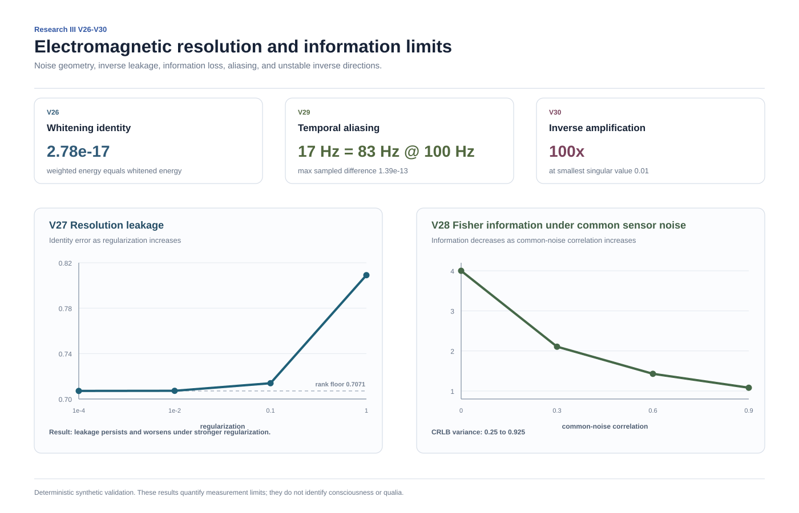

Audit: [Electromagnetic Resolution and Information Program](electromagnetic-resolution-program.md), [`v26_correlated_noise_whitening.csv`](../results/v26_correlated_noise_whitening.csv), [`v27_resolution_leakage.csv`](../results/v27_resolution_leakage.csv), [`v28_fisher_information.csv`](../results/v28_fisher_information.csv), [`v29_temporal_aliasing.csv`](../results/v29_temporal_aliasing.csv), [`v30_inverse_noise_amplification.csv`](../results/v30_inverse_noise_amplification.csv), [`electromagnetic_resolution_validation_summary.json`](../results/electromagnetic_resolution_validation_summary.json).

**Claim ceiling:** V26-V30 establish measurement-resolution and information-limit properties only. They do not establish a consciousness-specific information threshold, a uniquely correct source reconstruction, or direct measurement of qualia.

---

# Electromagnetic design and spatial-specificity layer V31-V35

V31-V35 move from resolution diagnosis to explicit measurement design.

## V31. Point-spread and cross-talk functions

For linear resolution matrix \(\mathbf R=\mathbf G\mathbf L\),

\[
\operatorname{PSF}_k=\mathbf R_{:,k},
\qquad
\operatorname{CTF}_i^\top=\mathbf R_{i,:}.
\]

The canonical asymmetric construction gives off-target leakage norms about `0.1414` for the point-spread function and `0.2828` for the cross-talk function.

## V32. Noise-aware source distinguishability

For topographies \(\boldsymbol\ell_1,\boldsymbol\ell_2\) and covariance \(\mathbf C\),

\[
d_C^2
=
(\boldsymbol\ell_1-\boldsymbol\ell_2)^\top
\mathbf C^{-1}
(\boldsymbol\ell_1-\boldsymbol\ell_2).
\]

The canonical close pair has squared distance about `0.00323`, while the distinct pair has squared distance about `2.33945`.

## V33. Fisher-information sensor design

For local sensitivity matrix \(\mathbf A\),

\[
\mathbf F=\mathbf A^\top\mathbf C^{-1}\mathbf A.
\]

The three-sensor redundant design has minimum eigenvalue `0.0008`; the three-sensor complementary design has minimum eigenvalue `1.0`. Equal sensor count does not imply equal information geometry.

## V34. Exact nuisance-information law

For a whitened target direction and a one-dimensional nuisance direction separated by angle \(\theta\),

\[
\boxed{
\rho_{\mathrm{ret}}=\sin^2\theta.
}
\]

Aligned nuisance removal deletes the target direction; orthogonal nuisance removal preserves it.

## V35. Exact robust information bound

For nominal whitened topography \(\mathbf w\) and uncertainty radius \(\epsilon\),

\[
\boxed{
I_{\mathrm{rob}}(\epsilon)
=
[\max(\|\mathbf w\|_2-\epsilon,0)]^2.
}
\]

The anti-aligned perturbation construction attains the bound.

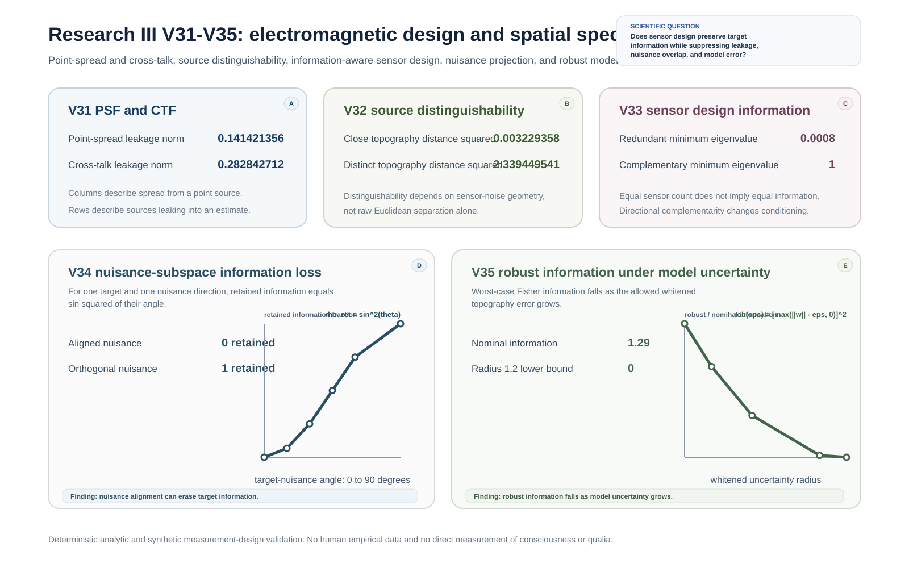

Audit: [Electromagnetic Design and Spatial Specificity Program](electromagnetic-design-spatial-specificity.md), [`v31_point_spread_cross_talk.csv`](../results/v31_point_spread_cross_talk.csv), [`v32_source_distinguishability.csv`](../results/v32_source_distinguishability.csv), [`v33_sensor_design_information.csv`](../results/v33_sensor_design_information.csv), [`v34_nuisance_information_loss.csv`](../results/v34_nuisance_information_loss.csv), [`v35_robust_model_information.csv`](../results/v35_robust_model_information.csv), [`electromagnetic_design_validation_summary.json`](../results/electromagnetic_design_validation_summary.json).

**Claim ceiling:** V31-V35 establish measurement-design, spatial-specificity, nuisance-loss, and robust-information properties only. They do not establish an experiential spatial metric, a consciousness-optimal sensor array, or direct measurement of qualia.

---

# Finite-sample electromagnetic inference layer V36-V40

V36-V40 add estimator calibration, covariance-estimation effects, source discrimination, multiplicity, and covariance-model mismatch.

## V36. Efficient scalar-amplitude inference

For
\[
\mathbf y=a\boldsymbol\ell+\boldsymbol\eta,
\qquad
\boldsymbol\eta\sim\mathcal N(\mathbf 0,\mathbf C),
\]
the generalized least-squares estimator is
\[
\widehat a
=
\frac{\boldsymbol\ell^\top\mathbf C^{-1}\mathbf y}
{\boldsymbol\ell^\top\mathbf C^{-1}\boldsymbol\ell},
\]
with exact variance
\[
\boxed{
\operatorname{Var}(\widehat a)
=
\frac{1}
{\boldsymbol\ell^\top\mathbf C^{-1}\boldsymbol\ell}.
}
\]

The canonical 40,000-trial fixed-seed simulation gives empirical variance `0.784476` against exact `0.783290`, with 95 percent interval coverage `0.947775`.

## V37. Inverse-covariance bias

If
\[
\mathbf W\sim\operatorname{Wishart}_p(\mathbf C,\nu),
\qquad
\mathbf S=\mathbf W/\nu,
\]
then for \(\nu>p+1\),
\[
\boxed{
\mathbb E[\mathbf S^{-1}]
=
\frac{\nu}{\nu-p-1}\mathbf C^{-1}.
}
\]

For \(p=4\), the multiplier falls from `6.0` at \(\nu=6\) to about `1.1111` at \(\nu=50\).

## V38. Gaussian source discrimination

For two equal-prior Gaussian sensor models with common covariance and Mahalanobis distance \(d\),
\[
\boxed{
P_{\mathrm{error}}
=
\Phi(-d/2).
}
\]

The canonical error falls from `0.5` at \(d=0\) to about `0.0668` at \(d=3\).

## V39. Independent-search FWER

For \(K\) independent two-sided standard-normal tests,
\[
\boxed{
\operatorname{FWER}(t,K)
=
1-[2\Phi(t)-1]^K.
}
\]

The exact threshold controlling FWER at \(\alpha\) is
\[
\boxed{
t_{\alpha,K}
=
\Phi^{-1}
\left(
\frac{1+(1-\alpha)^{1/K}}{2}
\right).
}
\]

At \(\alpha=0.05\), the threshold rises from about `1.96` for one comparison to about `4.05` for 1000 independent comparisons.

## V40. Covariance-mismatch calibration

For weighted estimator
\[
\widehat a_{\mathbf W}
=
\frac{\boldsymbol\ell^\top\mathbf W\mathbf y}
{\boldsymbol\ell^\top\mathbf W\boldsymbol\ell},
\]
the exact variance under true covariance \(\mathbf C\) is
\[
\boxed{
\operatorname{Var}(\widehat a_{\mathbf W})
=
\frac{
\boldsymbol\ell^\top\mathbf W\mathbf C\mathbf W\boldsymbol\ell
}{
(\boldsymbol\ell^\top\mathbf W\boldsymbol\ell)^2
}.
}
\]

The canonical oracle weighting is calibrated, while identity and diagonal weighting understate uncertainty by about 33 percent.

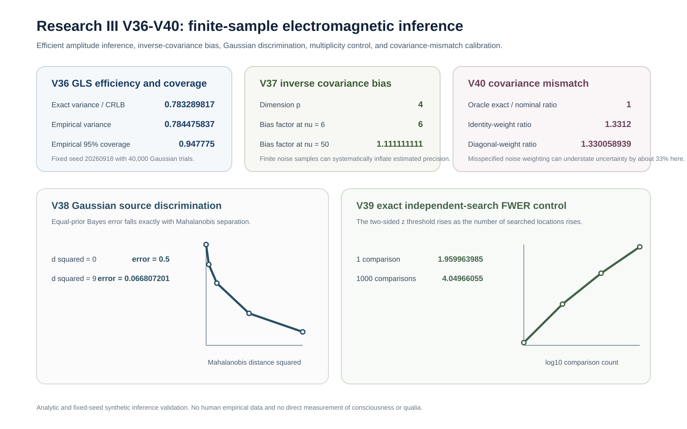

Audit: [Finite-Sample Electromagnetic Inference Program](electromagnetic-finite-sample-inference.md), [`v36_gls_amplitude_efficiency.csv`](../results/v36_gls_amplitude_efficiency.csv), [`v37_inverse_covariance_bias.csv`](../results/v37_inverse_covariance_bias.csv), [`v38_gaussian_source_discrimination.csv`](../results/v38_gaussian_source_discrimination.csv), [`v39_independent_search_fwer.csv`](../results/v39_independent_search_fwer.csv), [`v40_covariance_mismatch_sandwich.csv`](../results/v40_covariance_mismatch_sandwich.csv), [`electromagnetic_finite_sample_validation_summary.json`](../results/electromagnetic_finite_sample_validation_summary.json).

**Claim ceiling:** V36-V40 establish finite-sample inference, multiplicity, and covariance-calibration properties only. They do not establish a consciousness classifier, a universal source threshold, or direct measurement of qualia.

---

# Multiplicity and selection-safe inference layer V41-V45

V41-V45 make search-wide error control and data reuse explicit.

## V41. Arbitrary-dependence Bonferroni control

For K null tests with per-test error at most alpha/K, the union bound gives

\[
P\left(\bigcup_{k=1}^K A_k\right)
\le
\sum_{k=1}^K P(A_k)
\le
\alpha.
\]

For two-sided Gaussian statistics,

\[
t_{\alpha,K}^{\mathrm{Bonf}}
=
\Phi^{-1}\left(1-\frac{\alpha}{2K}\right).
\]

The canonical union-bound FWER is 0.05 for K = 1, 10, 100, and 1000 up to floating-point roundoff.

## V42. Holm step-down gain

For raw p-values (0.001, 0.016, 0.017, 0.5), the Holm adjusted values are

\[
(0.004,\ 0.048,\ 0.048,\ 0.5).
\]

At alpha = 0.05, Holm rejects three hypotheses while single-step Bonferroni rejects one.

## V43. Exact sign-flip maximum statistic

The declared six-row, two-source construction has 2^6 = 64 sign configurations. Two orbit elements meet or exceed the observed max-absolute-mean statistic, giving

\[
p_{\mathrm{flip}}=\frac{2}{64}=0.03125.
\]

## V44. Exact post-selection coverage collapse

Under independent null coordinates, selecting the largest absolute statistic and reusing its ordinary marginal interval gives

\[
\boxed{C_{\mathrm{selected}}=c^K.}
\]

At nominal marginal coverage c = 0.95, selected coverage is about 0.00592053 for K = 100.

## V45. Independent confirmation restores Type I error

If discovery selects an index and confirmation data are independent under the null,

\[
P\left(|Z_J^{\mathrm{conf}}|>z_{1-\alpha/2}\right)=\alpha.
\]

The fixed-seed K = 100 simulation gives same-data reuse false-positive rate 0.99382 and independent-holdout false-positive rate 0.04986.

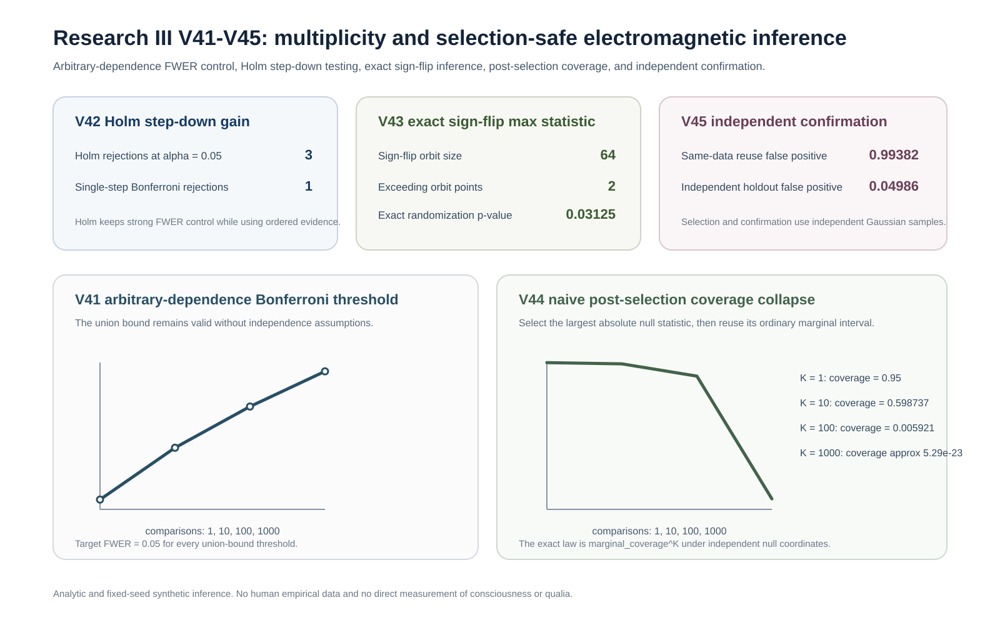

Audit: [Multiplicity and Selection-Safe Electromagnetic Inference](electromagnetic-selection-safe-inference.md), [V41 results](../results/v41_bonferroni_arbitrary_dependence.csv), [V42 results](../results/v42_holm_step_down.csv), [V43 results](../results/v43_sign_flip_max_statistic.csv), [V44 results](../results/v44_post_selection_coverage.csv), [V45 results](../results/v45_independent_holdout.csv), and [summary JSON](../results/electromagnetic_selection_validation_summary.json).

**Claim ceiling:** V41-V45 establish multiplicity-control, randomization, and selection-safe inference properties only. They do not establish that a statistically significant electromagnetic source is a consciousness source or that search-wide statistical validity solves target identification.

---

# Cross-site replication inference and stability layer V46-V50

V46-V50 ask whether a declared site-level result is stable across synthetic study units rather than being carried by one high-weight site. This layer is about replication inference, not real-world replication.

## V46. Inverse-variance common-effect pooling

For site estimates \(\widehat\theta_i\) with known standard errors \(s_i\),

\[
w_i=s_i^{-2},
\qquad
\widehat\theta_{\mathrm{FE}}
=
\frac{\sum_i w_i\widehat\theta_i}{\sum_i w_i},
\qquad
\operatorname{SE}(\widehat\theta_{\mathrm{FE}})
=
\frac{1}{\sqrt{\sum_i w_i}}.
\]

The canonical four-site construction gives pooled estimate 0.4268600252 and standard error 0.0639198742.

## V47. Known-variance heterogeneity

Under the independent Gaussian common-effect model,

\[
Q
=
\sum_i
w_i
(\widehat\theta_i-\widehat\theta_{\mathrm{FE}})^2
\sim
\chi^2_{K-1}.
\]

The observed canonical value is 0.9200868712. In 50,000 fixed-seed common-effect draws, the simulated mean Q is 3.0115441662 versus theoretical 3, and the simulated variance is 6.0378717168 versus theoretical 6.

## V48. Exact leave-one-site-out influence

Deleting site \(i\) changes the pooled estimate by

\[
\boxed{
\widehat\theta_{(-i)}
-
\widehat\theta_{\mathrm{FE}}
=
\frac{
w_i(\widehat\theta_{\mathrm{FE}}-\widehat\theta_i)
}{
W-w_i
}.
}
\]

The canonical shifts are approximately +0.00272, -0.01777, +0.03928, and -0.01179. Direct deletion and the exact identity agree to floating-point precision.

## V49. Partial-conjunction replicability

For ordered valid site-level p-values \(p_{(1)}\le\cdots\le p_{(K)}\), the Bonferroni partial-conjunction construction is

\[
\boxed{
p_{\mathrm{PC}}^{(r)}
=
\min\left[1,(K-r+1)p_{(r)}\right].
}
\]

For the canonical five-site sequence, the p-values for requiring at least one through five non-null sites are 0.005, 0.048, 0.12, 0.42, and 0.45.

## V50. Site-weight concentration

With normalized inverse-variance weights \(a_i=w_i/W\),

\[
\boxed{
K_{\mathrm{eff}}
=
\frac{1}{\sum_i a_i^2}
}
\]

and deleting site \(i\) inflates the common-effect variance by

\[
\boxed{
\frac{1}{1-a_i}.
}
\]

Four equal-weight sites give \(K_{\mathrm{eff}}=4\). In the dominant-site construction, one site carries \(16/19\) of the weight, the effective site count falls to about 1.3938, and deleting the dominant site inflates variance by \(19/3\).

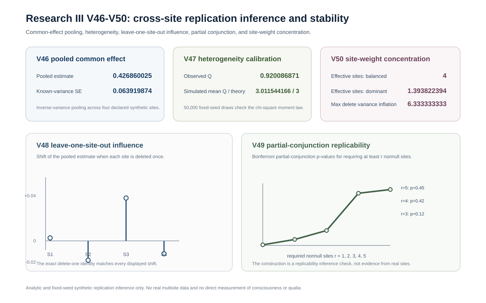

Audit: [Cross-Site Replication Inference and Stability](electromagnetic-replication-inference.md), [V46 results](../results/v46_common_effect_pooling.csv), [V47 results](../results/v47_common_effect_heterogeneity.csv), [V48 results](../results/v48_leave_one_site_out.csv), [V49 results](../results/v49_partial_conjunction_replicability.csv), [V50 results](../results/v50_site_weight_concentration.csv), and [summary JSON](../results/electromagnetic_replication_validation_summary.json).

**Claim ceiling:** V46-V50 establish properties of declared pooling, heterogeneity, influence, partial-conjunction, and weight-concentration calculations. They do not establish external replication in real sites, a consciousness-specific electromagnetic marker, or direct measurement of experience.

---

# Reproducibility map

| Layer | Reproduce | Code | Tests | Machine-readable record |
|---|---|---|---|---|
| V1-V5 | `python scripts/run_validation_program.py` | `latent_measurement.py`, `simulation_validation.py` | V1-V5 tests | V1-V5 CSV/JSON files in `results/` |
| V6-V10 | `python scripts/run_robustness_validation.py` | `measurement_robustness.py`, `robustness_simulations.py` | V6-V10 tests | V6-V10 CSV/JSON files in `results/` |
| V11-V15 | `python scripts/run_identification_design_validation.py` | `identification_design.py`, `identification_design_simulations.py` | V11-V15 theorem and simulation tests | V11-V15 CSV/JSON files in `results/` |
| V16-V20 | `python scripts/run_electromagnetic_validation.py` | `electromagnetic_observables.py`, `electromagnetic_simulations.py` | EM physical, invariance, non-identifiability, confound, and frequency tests | V16-V20 CSV/JSON files in `results/` |
| V21-V25 | `python scripts/run_electromagnetic_inverse_validation.py` | `electromagnetic_inverse.py`, `electromagnetic_inverse_simulations.py` | reference, null-space, regularization, multimodal, and forward-model tests | V21-V25 CSV/JSON files in `results/` |
| V26-V30 | `python scripts/run_electromagnetic_resolution_validation.py` | `electromagnetic_resolution.py`, `electromagnetic_resolution_simulations.py` | covariance, resolution, Fisher-information, aliasing, and singular-amplification tests | V26-V30 CSV/JSON files in `results/` |
| V31-V35 | `python scripts/run_electromagnetic_design_validation.py` | `electromagnetic_design.py`, `electromagnetic_design_simulations.py` | PSF/CTF, distinguishability, Fisher design, nuisance-loss, and robust-information tests | V31-V35 CSV/JSON files in `results/` |
| V36-V40 | `python scripts/run_electromagnetic_finite_sample_validation.py` | `electromagnetic_finite_sample.py`, `electromagnetic_finite_sample_simulations.py` | GLS, covariance-bias, discrimination, FWER, and sandwich-variance tests | V36-V40 CSV/JSON files in `results/` |
| V41-V45 | `python scripts/run_electromagnetic_selection_validation.py` | `electromagnetic_selection.py`, `electromagnetic_selection_simulations.py` | Bonferroni, Holm, sign-flip, selection-coverage, and holdout-confirmation tests | V41-V45 CSV/JSON files in `results/` |
| V46-V50 | `python scripts/run_electromagnetic_replication_validation.py` | `electromagnetic_replication.py`, `electromagnetic_replication_simulations.py` | common-effect, Q calibration, delete-one, partial-conjunction, and site-weight tests | V46-V50 CSV/JSON files in `results/` |
| Whole repository | `make check` | all source modules | complete pytest suite | repository policy and CI record |

Canonical seeds are `20260917` for V1-V5, `20260918` for V6-V10, `20260919` for V11-V15 fixed-seed checks, and `20260918` for the V36 Monte Carlo calibration check, V45 holdout simulation, and V47 common-effect Q calibration. V16-V35, V37-V44, V46, and V48-V50 are deterministic or analytic.

# How to read the figures

A figure supports only the narrow statement generated by its declared theorem or experiment. Before using a figure in a manuscript or presentation, verify the declared target, the assumptions, the code path, the machine-readable record, the failure condition, and the strongest claim the result can support.

A successful analytic or synthetic validation does not validate a consciousness biomarker in people or systems. That empirical burden remains separate.
