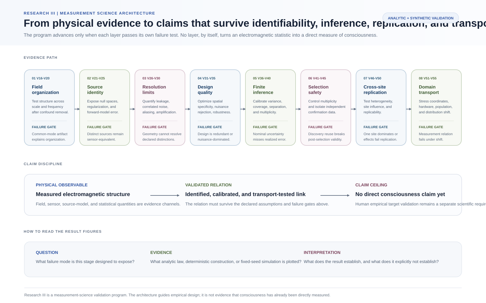

# Visual Research Guide

This page is the visual entry point for Research III: Consciousness Measurement Science.

The program is intentionally theory-neutral and measurement-first. It asks what a scientific consciousness claim would have to expose: the declared experiential target, observable evidence, assumptions, identification status, validation domain, uncertainty, falsification conditions, and the strongest claim that the evidence actually licenses.

**Current status:** foundational specification and computational scaffold. The figures below organize the scientific program. They do not constitute prospective human validation, clinical validation, or direct third-person measurement of qualia.

## V16-V55 evidence architecture

This orientation schematic connects the electromagnetic and transportability validation layers into one reviewer-facing logic path. Each stage exposes its scientific question, the failure gate it is meant to catch, and the claim ceiling that remains after the stage passes. The schematic is a navigation and reasoning aid, not an additional empirical result.

Related records: [Formal Validation V1-V55](../VALIDATION.md), [Validation Atlas](validation-atlas.md), [Evidence-to-Claim Audit](evidence-to-claim-audit.md).

## 1. Whole-program map

The program begins with five declared targets: presence, global state, content, phenomenal structure, and capacity. Observable evidence is then interpreted only through explicit assumptions, identification analysis, validation, and claim discipline.

Related records: [Formal Measurement Framework](measurement-framework.md), [Assumption Registry](assumption-registry.md), [Claim Registry](claim-registry.md).

## 2. What evidence belongs to which target?

A channel can be useful for one target and insufficient for another. The matrix is therefore target-specific rather than a ranking of modalities. It is designed to prevent category errors such as treating one failed behavioral channel as proof of absent experience or treating a predictive neural marker as a direct reading of subjective feel.

Related records: [Measurement Instrument Specification](measurement-instrument-spec.md), [Failure Modes](failure-modes.md), [Clinical Translation](clinical-translation.md).

## 3. The core measurement architecture

The architecture separates the latent experiential target from observable channels and preserves uncertainty, assumptions, validation domain, and allowed claim level in the output.

Related record: [Formal Measurement Framework](measurement-framework.md).

## 4. Anatomy of the Consciousness Evidence Profile

The Consciousness Evidence Profile, or CEP, is structured before it is scalar. A record carries the declared target, channel evidence, data quality, context, assumptions, uncertainty, validation domain, and claim ceiling together.

Related records: [CEP Specification](measurement-instrument-spec.md), [CEP schema](../schemas/cep.schema.json), [Worked CEP example](../examples/cep_example.json).

## 5. Identification and uncertainty

A valid scientific output can be a point estimate, an identification region, or an abstention. Partial identification is not treated as a failed analysis. It is the correct result when the evidence and assumptions do not support a unique answer.

Related records: [Statistical Validation](statistical-validation.md), [Dependence-Robust Partial Identification](partial-identification.md).

## 6. Phenomenal-structure measurement

The structural arm compares preregistered relations among experiences with preregistered physical or neural relational structure. Low held-out distortion can support a declared mapping family. High distortion can reject it. Neither outcome establishes ontological identity between neural structure and experience.

Related record: [Phenomenal Structure Program](phenomenal-structure.md).

## 7. Validation program

The validation burden grows in stages: benchmark report-rich conditions, confound separation, transport across altered states, causal perturbation, clinical stress testing, held-out structural prediction, and finally adversarial theory tests.

Related records: [Experimental Program](experimental-program.md), [Phase 1 Protocol](protocol-phase1.md), [Preregistration Template](preregistration-template.md), [Roadmap](../ROADMAP.md).

## 8. Theory comparison and falsification

The program compares theory families through declared commitments and preregistered divergent predictions. Shared support is not the same as a unique theory win, and a theory-relative empirical result does not settle ontology.

Related records: [Theory Landscape](theory-landscape.md), [Falsification Matrix](falsification-matrix.md).

## 9. Measurement claim ladder

The M0-M7 ladder prevents a result from being promoted beyond its validation record. M0 begins with a condition difference. M7 requires a unique preregistered theory prediction to survive while relevant rivals fail. No rung licenses the statement that qualia have been directly measured.

Related records: [Claim Registry](claim-registry.md), [Claim schema](../schemas/claim.schema.json), [Worked claim example](../examples/claim_example.json).

## What is established now?

The current repository establishes a documented measurement-science architecture, explicit target taxonomy, machine-readable evidence and claim records, a dependence-robust partial-identification scaffold, a structural-alignment scaffold, preregistration and validation rules, a theory-falsification framework, and explicit clinical and ethical boundaries.

## What remains open?

The repository does not yet establish a prospectively validated general consciousness measure, a universal threshold, clinical diagnostic validity, substrate-independent scalar measurement, or direct third-person access to phenomenal content. These remain empirical and conceptual research problems.

## Audit path

For each visual claim, readers should be able to move from the figure to the relevant specification, assumptions, validation rules, software object when one exists, and explicit nonclaims. The complete visual inventory is in the [Figure Catalog](figure-catalog.md). The complete documentation index is in [Documentation Map](README.md).
